# Architecture Overview

## System Architecture

This application demonstrates enterprise-ready AI agent patterns using Azure AI Foundry, .NET Aspire, and a microservices architecture.

## High-Level Architecture Diagram

```mermaid
graph TB
    subgraph "Client Layer"
        Store[Store - Blazor Frontend]
    end
    
    subgraph ".NET Aspire Orchestration"
        AppHost[ZavaAppHost - Service Orchestrator]
    end
    
    subgraph "Agent Demo Services"
        SingleAgent[Single Agent Demo]
        MultiAgent[Multi-Agent Demo]
        AgentCatalog[Agents Catalog Service]
    end
    
    subgraph "Microservices Layer"
        AnalyzePhoto[Analyze Photo Service]
        CustomerInfo[Customer Information Service]
        Inventory[Inventory Service]
        Location[Location Service]
        Matchmaking[Matchmaking Service]
        Navigation[Navigation Service]
        ProductSearch[Product Search Service]
        ToolReasoning[Tool Reasoning Service]
    end
    
    subgraph "Data Layer"
        Products[Products Service]
        SQL[(SQL Server Database)]
    end
    
    subgraph "Azure AI Foundry"
        AIFoundry[AI Foundry Project]
        GPT[GPT-4o-mini Model]
        Embeddings[Text Embedding Model]
        Agents[AI Foundry Agents]
    end
    
    subgraph "Azure Services"
        AppInsights[Application Insights]
    end
    
    Store --> SingleAgent
    Store --> MultiAgent
    Store --> AgentCatalog
    Store --> Products
    
    SingleAgent --> AnalyzePhoto
    SingleAgent --> CustomerInfo
    SingleAgent --> ToolReasoning
    SingleAgent --> Inventory
    SingleAgent --> ProductSearch
    
    MultiAgent --> AnalyzePhoto
    MultiAgent --> CustomerInfo
    MultiAgent --> ToolReasoning
    MultiAgent --> Inventory
    MultiAgent --> ProductSearch
    MultiAgent --> Matchmaking
    MultiAgent --> Location
    MultiAgent --> Navigation
    
    AgentCatalog --> AnalyzePhoto
    AgentCatalog --> CustomerInfo
    AgentCatalog --> ToolReasoning
    AgentCatalog --> Inventory
    AgentCatalog --> ProductSearch
    AgentCatalog --> Matchmaking
    AgentCatalog --> Location
    AgentCatalog --> Navigation
    
    Products --> SQL
    
    AnalyzePhoto -.-> AIFoundry
    CustomerInfo -.-> AIFoundry
    ToolReasoning -.-> AIFoundry
    Inventory -.-> AIFoundry
    ProductSearch -.-> AIFoundry
    Matchmaking -.-> AIFoundry
    Location -.-> AIFoundry
    Navigation -.-> AIFoundry
    
    AIFoundry --> GPT
    AIFoundry --> Embeddings
    AIFoundry --> Agents
    
    Store -.-> AppInsights
    SingleAgent -.-> AppInsights
    MultiAgent -.-> AppInsights
    AgentCatalog -.-> AppInsights
    AnalyzePhoto -.-> AppInsights
    CustomerInfo -.-> AppInsights
    ToolReasoning -.-> AppInsights
    Inventory -.-> AppInsights
    ProductSearch -.-> AppInsights
    Matchmaking -.-> AppInsights
    Location -.-> AppInsights
    Navigation -.-> AppInsights
    Products -.-> AppInsights
    
    AppHost -.-> Store
    AppHost -.-> SingleAgent
    AppHost -.-> MultiAgent
    AppHost -.-> AgentCatalog
    AppHost -.-> Products
    AppHost -.-> AnalyzePhoto
    AppHost -.-> CustomerInfo
    AppHost -.-> ToolReasoning
    AppHost -.-> Inventory
    AppHost -.-> ProductSearch
    AppHost -.-> Matchmaking
    AppHost -.-> Location
    AppHost -.-> Navigation
```

## Architecture Layers

### 1. Client Layer

**Store (Blazor Frontend)**
- Provides the user interface for the AI-powered store
- Supports both Single Agent and Multi-Agent demonstrations
- Includes settings page for switching between agent frameworks
- Built with Blazor Server for interactive web UI

### 2. Orchestration Layer

**.NET Aspire (ZavaAppHost)**
- Centralized service orchestration and configuration
- Manages service dependencies and startup order
- Handles connection strings and environment variables
- Provides service discovery and health monitoring
- Supports both local development and Azure deployment

### 3. Agent Demo Services

**Single Agent Demo**
- Demonstrates simple agent workflows
- Single agent coordinating with multiple tools
- Shows semantic search and image analysis capabilities

**Multi-Agent Demo**
- Demonstrates complex multi-agent orchestration
- Multiple specialized agents working together
- Sequential and concurrent agent execution patterns
- Agent handoff and collaboration scenarios

**Agents Catalog Service**
- Central registry of all available agents
- Provides agent discovery and metadata
- Facilitates agent reuse across different scenarios

### 4. Microservices Layer

Each microservice is a specialized agent tool provider:

**Analyze Photo Service**
- Image analysis and product recognition
- Visual search capabilities
- Connected to Azure AI Vision

**Customer Information Service**
- Customer profile management
- Customer preferences and history
- Personalized recommendations

**Inventory Service**
- Real-time inventory checks
- Stock level management
- Product availability queries

**Location Service**
- Store location information
- Geographic data and mapping
- Distance calculations

**Matchmaking Service**
- Product recommendation engine
- Customer-product matching
- Personalized suggestions

**Navigation Service**
- In-store navigation
- Product location guidance
- Route optimization

**Product Search Service**
- Semantic product search
- Natural language queries
- Vector-based search with embeddings

**Tool Reasoning Service**
- Complex reasoning capabilities
- Multi-step problem solving
- Tool selection and orchestration

### 5. Data Layer

**Products Service**
- Product catalog management
- Product CRUD operations
- Search and filtering

**SQL Server Database**
- Persistent storage for product data
- Relational data management
- Supports transactions and queries

### 6. Azure AI Foundry

**AI Foundry Project**
- Central hub for AI resources
- Agent management and deployment
- Model configuration

**GPT-4o-mini Model**
- Chat completion
- Natural language understanding
- Reasoning and generation

**Text Embedding Model (ada-002)**
- Vector embeddings for semantic search
- Document similarity
- RAG (Retrieval Augmented Generation) support

**AI Foundry Agents**
- Specialized agents for each service
- Pre-configured with instructions and tools
- Managed in Azure AI Foundry portal

### 7. Observability

**Application Insights**
- End-to-end tracing
- Performance monitoring
- Error tracking and diagnostics
- Custom telemetry and metrics

## Design Patterns

### 1. Microservices Architecture
- Each service has a single responsibility
- Services are independently deployable
- Loosely coupled through HTTP APIs
- Enables horizontal scaling

### 2. Agent-Tool Pattern
- Agents act as intelligent coordinators
- Tools provide specific capabilities
- Agents decide which tools to use
- Tools return structured data

### 3. Orchestration Patterns

**Sequential Orchestration**
- Agent A completes → Agent B starts
- Linear workflow execution
- Used for dependent operations

**Concurrent Orchestration**
- Multiple agents run in parallel
- Results aggregated at the end
- Used for independent operations

**Handoff Orchestration**
- Agent A delegates to Agent B
- Context preserved across agents
- Used for specialized expertise

### 4. Service Discovery
- Services register with Aspire
- Dynamic endpoint resolution
- No hardcoded URLs
- Environment-specific configuration

### 5. Configuration Management
- Centralized in ZavaAppHost
- Connection strings as parameters
- Environment-specific settings
- Secure secrets handling

## Agent Framework Support

The application supports two agent frameworks that can be switched via the UI:

### Semantic Kernel (Default)
- Microsoft.SemanticKernel package
- Rich plugin ecosystem
- Mature and stable
- Wide community adoption

### Microsoft Agent Framework
- Microsoft.Agents.AI package
- New generation framework
- Optimized for Azure AI Foundry
- Advanced orchestration capabilities

Both frameworks:
- Connect to the same Azure AI Foundry agents
- Use the same microservices
- Support the same features
- Can be switched without code changes

## Communication Flow

### Request Flow
1. User interacts with Store UI
2. Store calls Agent Demo Service (Single or Multi)
3. Agent Demo Service invokes appropriate microservices
4. Microservices call Azure AI Foundry agents
5. AI Foundry agents use GPT models for reasoning
6. Results flow back through the chain
7. Store displays results to user

### Observability Flow
1. All services emit telemetry
2. Application Insights collects data
3. Correlation IDs track requests across services
4. Distributed tracing shows the complete path
5. Metrics and logs available in Azure Portal

## Technology Stack

### Backend
- **.NET 9** - Latest .NET framework
- **.NET Aspire** - Cloud-native orchestration
- **C#** - Primary programming language
- **ASP.NET Core** - Web API framework
- **Entity Framework Core** - Data access

### Frontend
- **Blazor Server** - Interactive web UI
- **HTML/CSS/JavaScript** - Web technologies

### AI/ML
- **Azure AI Foundry** - AI platform
- **Semantic Kernel** - Agent framework option 1
- **Microsoft Agent Framework** - Agent framework option 2
- **GPT-4o-mini** - Language model
- **text-embedding-ada-002** - Embedding model

### Data
- **SQL Server** - Relational database
- **Docker** - Container runtime

### Observability
- **Application Insights** - Monitoring and tracing
- **OpenTelemetry** - Telemetry standard

### DevOps
- **Azure DevOps / GitHub Actions** - CI/CD
- **Docker** - Containerization
- **Azure Container Apps** - Hosting (production)

## Security Considerations

1. **Authentication**: Handled by Azure AD integration
2. **Authorization**: Role-based access control
3. **Secrets Management**: Azure Key Vault for production
4. **Network Security**: Private endpoints and VNets
5. **Content Safety**: Azure AI Content Safety integration
6. **Data Privacy**: PII handling and compliance
7. **API Security**: Authentication tokens and rate limiting

## Scalability Features

1. **Horizontal Scaling**: Each service scales independently
2. **Load Balancing**: Built-in Azure load balancing
3. **Caching**: Response caching where appropriate
4. **Async Processing**: Non-blocking operations
5. **Connection Pooling**: Efficient resource usage
6. **Rate Limiting**: Protects against overload

## Deployment Options

### Local Development
- Docker Compose
- .NET Aspire orchestration
- Local SQL Server
- Connection string to Azure AI Foundry

### Azure Deployment
- Azure Container Apps
- Azure SQL Database
- Azure AI Foundry
- Application Insights
- Automated via azd deploy

## Next Steps

- [Application Components](02-application-components.md) - Detailed component descriptions
- [Service Interactions](03-service-interactions.md) - How services communicate
- [Getting Started](07-getting-started.md) - Set up your development environment
