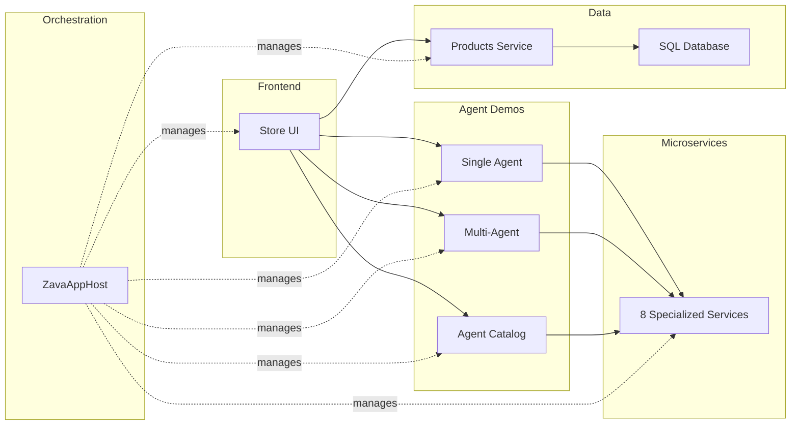
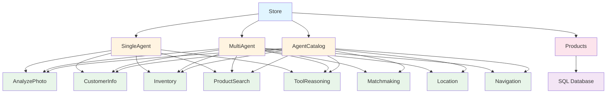

# Application Components

This document provides detailed information about each component in the application.

## Component Overview



## 1. Frontend Components

### Store (Blazor Frontend)

**Location**: `/src/Store/`

**Purpose**: Main user interface for the AI-powered store application

**Key Features**:
- Interactive Blazor Server UI
- Product browsing and search
- Single agent demo interface
- Multi-agent demo interface
- Agent catalog browser
- Settings page for framework selection

**Technology Stack**:
- Blazor Server
- C# / Razor Components
- Bootstrap for styling
- SignalR for real-time updates

**Key Components**:
- `Components/Pages/` - Page components
- `Components/Layout/` - Layout components
- `Services/` - HTTP client services
- `wwwroot/` - Static assets

**Dependencies**:
- Products Service (product data)
- Single Agent Demo (single agent workflows)
- Multi-Agent Demo (multi-agent workflows)
- Agent Catalog Service (agent discovery)
- All microservices (direct and indirect)

**Configuration**:
```json
{
  "AllowedHosts": "*",
  "Logging": {
    "LogLevel": {
      "Default": "Information"
    }
  }
}
```

**API Endpoints Consumed**:
- `/api/products` - Product operations
- `/api/singleagent/sk/*` - Semantic Kernel single agent
- `/api/singleagent/agentfx/*` - AgentFx single agent
- `/api/multiagent/sk/*` - Semantic Kernel multi-agent
- `/api/multiagent/agentfx/*` - AgentFx multi-agent
- `/api/agentcatalog` - Agent discovery

## 2. Orchestration Components

### ZavaAppHost (.NET Aspire)

**Location**: `/src/ZavaAppHost/`

**Purpose**: Central orchestration hub that manages all services

**Key Features**:
- Service registration and discovery
- Dependency management
- Configuration distribution
- Health monitoring
- Development dashboard
- Azure deployment support

**Managed Services**:
1. SQL Server (container)
2. Products Database
3. Products Service
4. Store Frontend
5. Single Agent Demo
6. Multi-Agent Demo
7. Agent Catalog Service
8. All 8 microservices

**Configuration Management**:
- Connection strings
- Azure AI Foundry settings
- Agent IDs
- Model deployment names
- Application Insights

**Key Code Sections**:
```csharp
// Service registration
var products = builder.AddProject<Projects.Products>("products")
    .WithReference(productsDb);

// Dependency management
var store = builder.AddProject<Projects.Store>("store")
    .WithReference(products)
    .WaitFor(products);

// Azure AI Foundry configuration
var openai = builder.AddAzureOpenAI("aifoundry");
var gpt5mini = aoai.AddDeployment("gpt-5-mini", ...);
```

**Environment Variables Managed**:
- `ConnectionStrings__aifoundry` - Azure AI Foundry connection
- `ConnectionStrings__aifoundryproject` - AI Foundry project
- `ConnectionStrings__appinsights` - Application Insights
- `AI_ChatDeploymentName` - GPT model deployment
- `AI_embeddingsDeploymentName` - Embeddings model
- Agent ID connection strings for each service

## 3. Agent Demo Components

### Single Agent Demo

**Location**: `/src/SingleAgentDemo/`

**Purpose**: Demonstrates single agent workflows with multiple tools

**Key Features**:
- Single agent coordinating multiple tools
- Semantic search integration
- Image analysis workflows
- Customer information retrieval
- Tool reasoning

**Architecture**:
- Single orchestrating agent
- Calls to multiple microservices
- Sequential and parallel tool execution
- Result aggregation

**Controllers**:
- `SingleAgentControllerSK.cs` - Semantic Kernel implementation
- `SingleAgentControllerAgentFx.cs` - Agent Framework implementation

**Endpoints**:
- `POST /api/singleagent/sk/execute` - SK execution
- `POST /api/singleagent/agentfx/execute` - AgentFx execution

**Use Cases**:
1. Product search based on natural language query
2. Image-based product search
3. Customer personalized recommendations
4. Inventory availability check

### Multi-Agent Demo

**Location**: `/src/MultiAgentDemo/`

**Purpose**: Demonstrates complex multi-agent orchestration patterns

**Key Features**:
- Multiple specialized agents
- Agent collaboration
- Sequential orchestration
- Concurrent orchestration
- Agent handoff patterns

**Orchestration Patterns**:

1. **Sequential**: Agent A → Agent B → Agent C
2. **Concurrent**: Agent A, B, C run in parallel
3. **Handoff**: Agent A delegates to specialized Agent B

**Controllers**:
- `MultiAgentControllerSK.cs` - Semantic Kernel implementation
- `MultiAgentControllerAgentFx.cs` - Agent Framework implementation

**Endpoints**:
- `POST /api/multiagent/sk/orchestrate` - SK orchestration
- `POST /api/multiagent/agentfx/orchestrate` - AgentFx orchestration

**Use Cases**:
1. Complex shopping scenario (search → inventory → location → navigation)
2. Product recommendation workflow (analyze → match → suggest)
3. Multi-step customer service (info → reasoning → resolution)

### Agent Catalog Service

**Location**: `/src/AgentsCatalogService/`

**Purpose**: Central registry and discovery service for all agents

**Key Features**:
- Agent metadata management
- Agent discovery
- Capability listing
- Health status
- Version information

**Endpoints**:
- `GET /api/agentcatalog` - List all agents
- `GET /api/agentcatalog/{agentId}` - Get agent details
- `GET /api/agentcatalog/capabilities` - List capabilities

**Agent Information Provided**:
- Agent ID
- Agent name
- Description
- Capabilities
- Tools available
- Status (active/inactive)
- Version

## 4. Microservice Components

### Analyze Photo Service

**Location**: `/src/AnalyzePhotoService/`

**Purpose**: Image analysis and product recognition

**Key Features**:
- Computer vision analysis
- Product identification from images
- Visual similarity search
- Image attribute extraction

**Azure AI Foundry Agent**: PhotoAnalyzer

**Controller**: `AnalyzePhotoController.cs`

**Endpoints**:
- `POST /api/analyzephoto/analyze` - Analyze image
- `POST /api/analyzephoto/identify` - Identify product in image

**Input**: Base64-encoded image or image URL

**Output**: 
```json
{
  "productId": "string",
  "confidence": 0.95,
  "attributes": ["color", "size", "style"],
  "suggestions": ["similar product IDs"]
}
```

### Customer Information Service

**Location**: `/src/CustomerInformationService/`

**Purpose**: Customer profile and preference management

**Key Features**:
- Customer profile retrieval
- Purchase history
- Preferences and favorites
- Personalization data

**Azure AI Foundry Agent**: CustomerInformation

**Controller**: `CustomerInformationController.cs`

**Endpoints**:
- `GET /api/customerinfo/{customerId}` - Get customer profile
- `GET /api/customerinfo/{customerId}/preferences` - Get preferences
- `GET /api/customerinfo/{customerId}/history` - Purchase history

**Output**:
```json
{
  "customerId": "string",
  "name": "string",
  "preferences": {
    "categories": ["tools", "hardware"],
    "brands": ["DeWalt", "Milwaukee"],
    "priceRange": { "min": 0, "max": 500 }
  },
  "purchaseHistory": []
}
```

### Inventory Service

**Location**: `/src/InventoryService/`

**Purpose**: Real-time inventory management and availability checks

**Key Features**:
- Stock level queries
- Product availability
- Store-specific inventory
- Low stock alerts

**Azure AI Foundry Agent**: Inventory

**Controller**: `InventoryController.cs`

**Endpoints**:
- `GET /api/inventory/{productId}` - Get inventory for product
- `GET /api/inventory/available` - Get available products
- `GET /api/inventory/store/{storeId}` - Store inventory

**Output**:
```json
{
  "productId": "string",
  "available": true,
  "quantity": 45,
  "stores": [
    {
      "storeId": "store-1",
      "quantity": 15
    }
  ]
}
```

### Location Service

**Location**: `/src/LocationService/`

**Purpose**: Store location information and geographic data

**Key Features**:
- Store finder
- Distance calculations
- Store hours
- Contact information

**Azure AI Foundry Agent**: LocationService

**Controller**: `LocationController.cs`

**Endpoints**:
- `GET /api/location/stores` - List all stores
- `GET /api/location/nearest?lat={lat}&lon={lon}` - Find nearest store
- `GET /api/location/store/{storeId}` - Store details

**Output**:
```json
{
  "storeId": "string",
  "name": "string",
  "address": "string",
  "coordinates": { "lat": 0, "lon": 0 },
  "distance": 2.5,
  "hours": "9AM-9PM",
  "phone": "555-0100"
}
```

### Matchmaking Service

**Location**: `/src/MatchmakingService/`

**Purpose**: Product recommendation and customer-product matching

**Key Features**:
- Personalized recommendations
- Product similarity
- Collaborative filtering
- Content-based filtering

**Azure AI Foundry Agent**: ProductMatchmaking

**Controller**: `MatchmakingController.cs`

**Endpoints**:
- `POST /api/matchmaking/recommend` - Get recommendations
- `POST /api/matchmaking/similar/{productId}` - Find similar products
- `POST /api/matchmaking/personalized/{customerId}` - Personalized suggestions

**Output**:
```json
{
  "recommendations": [
    {
      "productId": "string",
      "score": 0.92,
      "reason": "Based on your previous purchases"
    }
  ]
}
```

### Navigation Service

**Location**: `/src/NavigationService/`

**Purpose**: In-store navigation and product location guidance

**Key Features**:
- Product location in store
- Navigation routes
- Aisle information
- Optimal path calculation

**Azure AI Foundry Agent**: Navigation

**Controller**: `NavigationController.cs`

**Endpoints**:
- `GET /api/navigation/locate/{productId}` - Find product location
- `POST /api/navigation/route` - Calculate route
- `GET /api/navigation/aisle/{aisleId}` - Aisle information

**Output**:
```json
{
  "productId": "string",
  "location": {
    "aisle": "12",
    "section": "B",
    "shelf": "3"
  },
  "route": {
    "distance": 150,
    "duration": "2 minutes",
    "waypoints": ["entrance", "aisle-5", "aisle-12"]
  }
}
```

### Product Search Service

**Location**: `/src/ProductSearchService/`

**Purpose**: Semantic product search using natural language

**Key Features**:
- Natural language queries
- Vector-based search
- Semantic understanding
- Relevance ranking

**Azure AI Foundry Agent**: ProductSearch

**Controller**: `ProductSearchController.cs`

**Endpoints**:
- `POST /api/productsearch/search` - Natural language search
- `POST /api/productsearch/vector` - Vector similarity search
- `GET /api/productsearch/suggest?q={query}` - Search suggestions

**Input**:
```json
{
  "query": "red power drill with battery",
  "filters": {
    "category": "tools",
    "priceMax": 200
  },
  "top": 10
}
```

**Output**:
```json
{
  "results": [
    {
      "productId": "string",
      "name": "string",
      "score": 0.95,
      "relevance": "high"
    }
  ],
  "total": 42
}
```

### Tool Reasoning Service

**Location**: `/src/ToolReasoningService/`

**Purpose**: Complex reasoning and tool selection coordination

**Key Features**:
- Multi-step reasoning
- Tool selection logic
- Context management
- Decision making

**Azure AI Foundry Agent**: ToolReasoning

**Controller**: `ToolReasoningController.cs`

**Endpoints**:
- `POST /api/toolreasoning/reason` - Perform reasoning
- `POST /api/toolreasoning/plan` - Create action plan
- `POST /api/toolreasoning/decide` - Make decision

**Output**:
```json
{
  "decision": "string",
  "reasoning": "string",
  "confidence": 0.88,
  "toolsUsed": ["inventory", "location"],
  "steps": [
    {
      "step": 1,
      "action": "check inventory",
      "result": "available"
    }
  ]
}
```

## 5. Data Components

### Products Service

**Location**: `/src/Products/`

**Purpose**: Product catalog management

**Key Features**:
- Product CRUD operations
- Product search and filtering
- Category management
- Data seeding

**Controller**: `ProductsController.cs`

**Endpoints**:
- `GET /api/products` - List all products
- `GET /api/products/{id}` - Get product by ID
- `POST /api/products` - Create product
- `PUT /api/products/{id}` - Update product
- `DELETE /api/products/{id}` - Delete product
- `GET /api/products/search?q={query}` - Search products

**Database Schema**:
- Products table
- Categories table
- ProductImages table
- ProductAttributes table

### SQL Server Database

**Type**: Container (development) / Azure SQL (production)

**Databases**:
- `productsDb` - Product catalog

**Tables**:
- Products
- Categories
- Customers (mock data)
- Orders (mock data)

## 6. Shared Components

### ZavaServiceDefaults

**Location**: `/src/ZavaServiceDefaults/`

**Purpose**: Shared configuration and extensions

**Key Features**:
- Service defaults
- Health checks
- Telemetry configuration
- Common middleware

### Entity Libraries

**CartEntities** - Shopping cart models
**DataEntities** - Common data models
**SearchEntities** - Search-related models
**SharedEntities** - Shared domain models
**VectorEntities** - Vector search models

### Provider Libraries

**ZavaSemanticKernelProvider** - Semantic Kernel integration
**ZavaAIFoundrySKAgentsProvider** - AI Foundry + SK integration
**ZavaAgentFxAgentsProvider** - Agent Framework integration

## Component Dependencies



## Next Steps

- [Service Interactions](03-service-interactions.md) - Learn how components communicate
- [API Reference](04-api-reference.md) - Detailed API documentation
