# Service Interactions

This document explains how the different services communicate and interact with each other.

## Communication Overview

All service communication follows these patterns:
- **HTTP/REST** for service-to-service communication
- **SignalR** for real-time UI updates
- **gRPC** (optional, not currently used)
- **Message correlation** for distributed tracing

## Single Agent Workflow

### Example: Product Search Query

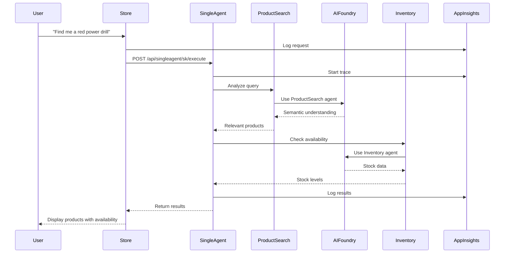

### Request Flow Details

1. **User Interaction**: User enters natural language query
2. **Store Processing**: 
   - Validates input
   - Selects framework (SK or AgentFx)
   - Routes to appropriate endpoint
3. **Single Agent Coordination**:
   - Receives request with correlation ID
   - Analyzes query intent
   - Selects relevant tools/services
   - Calls ProductSearch service
4. **ProductSearch Service**:
   - Receives search query
   - Calls Azure AI Foundry agent
   - Agent uses GPT model for semantic understanding
   - Performs vector search
   - Returns ranked results
5. **Inventory Check**:
   - Single Agent calls Inventory service
   - Inventory service queries stock data
   - Returns availability for each product
6. **Result Aggregation**:
   - Single Agent combines results
   - Formats response
   - Returns to Store
7. **UI Display**:
   - Store receives results
   - Renders product cards
   - Shows stock status

## Multi-Agent Workflow

### Example: Complex Shopping Scenario

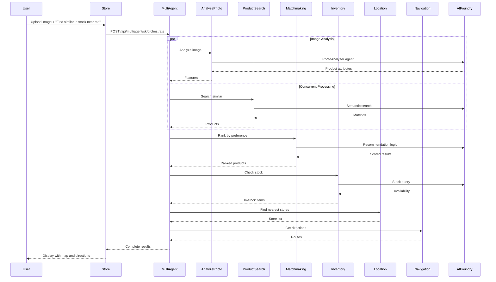

### Orchestration Patterns

#### 1. Sequential Orchestration

When steps depend on previous results:

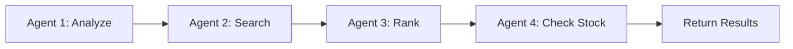

**Use Cases**:
- Product search → Inventory check → Location
- Customer info → Personalization → Recommendations
- Image analysis → Product matching → Availability

**Implementation**:
```csharp
// Pseudo-code
var analysis = await AnalyzePhoto(image);
var products = await ProductSearch(analysis.Attributes);
var available = await Inventory.Check(products);
var locations = await Location.FindStores(available);
return CombineResults(analysis, products, available, locations);
```

#### 2. Concurrent Orchestration

When operations are independent:

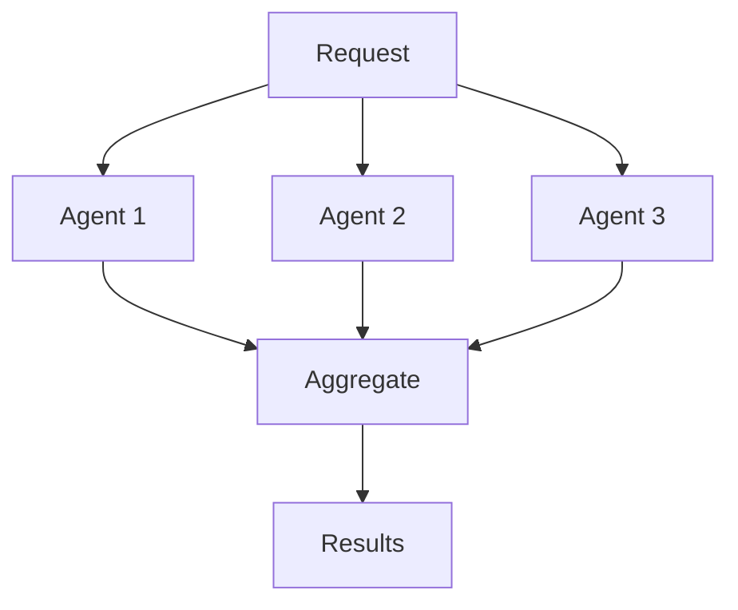

**Use Cases**:
- Fetch customer info + inventory + locations simultaneously
- Parallel product search across multiple categories
- Concurrent analysis of multiple images

**Implementation**:
```csharp
// Pseudo-code
var tasks = new[]
{
    CustomerInfo.GetProfile(customerId),
    Inventory.CheckAll(productIds),
    Location.GetStores(),
    Matchmaking.GetRecommendations(customerId)
};
var results = await Task.WhenAll(tasks);
return AggregateResults(results);
```

#### 3. Handoff Orchestration

When specialized expertise is needed:

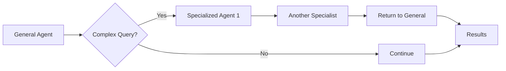

**Use Cases**:
- Complex reasoning → Specialized tool agent
- General search → Category-specific agent
- Initial triage → Expert agent

**Implementation**:
```csharp
// Pseudo-code
var initialAnalysis = await ToolReasoning.Analyze(query);
if (initialAnalysis.RequiresSpecialist)
{
    var specialist = SelectSpecialist(initialAnalysis.Domain);
    var result = await specialist.Handle(query, initialAnalysis.Context);
    return await ToolReasoning.Synthesize(result);
}
return initialAnalysis.Result;
```

## Service-to-Service Communication

### HTTP REST API Pattern

All microservices expose REST APIs:

```csharp
// Example: Calling Inventory Service from Single Agent
public class SingleAgentController : ControllerBase
{
    private readonly HttpClient _inventoryClient;
    
    public SingleAgentController(IHttpClientFactory factory)
    {
        _inventoryClient = factory.CreateClient("inventoryservice");
    }
    
    public async Task<InventoryResult> CheckInventory(string productId)
    {
        var response = await _inventoryClient.GetAsync($"/api/inventory/{productId}");
        response.EnsureSuccessStatusCode();
        return await response.Content.ReadFromJsonAsync<InventoryResult>();
    }
}
```

### Service Discovery

Aspire provides automatic service discovery:

```csharp
// ZavaAppHost configuration
var inventoryService = builder.AddProject<Projects.InventoryService>("inventoryservice");
var singleAgentDemo = builder.AddProject<Projects.SingleAgentDemo>("singleagentdemo")
    .WithReference(inventoryService); // Automatic endpoint injection

// In SingleAgentDemo, the URL is automatically available
// No hardcoded URLs needed!
```

### Request Headers

All service calls include:

```http
GET /api/inventory/12345 HTTP/1.1
Host: inventoryservice
X-Correlation-ID: 7b3f8a2c-9e1d-4f6b-a5c3-8d9e2f1a3b4c
Authorization: Bearer <token>
Accept: application/json
User-Agent: SingleAgentDemo/1.0
```

## Azure AI Foundry Integration

### Agent Invocation Pattern

Each microservice connects to its Azure AI Foundry agent:

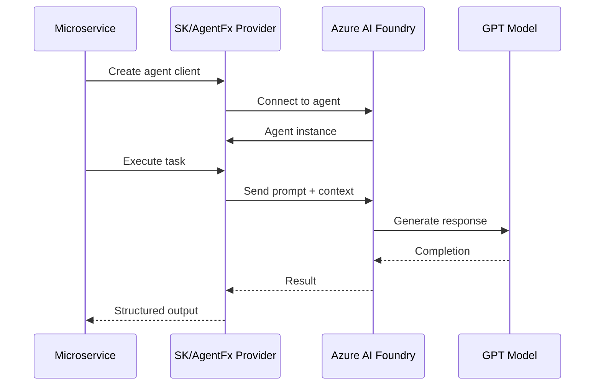

### Example: Inventory Service Agent Call

```csharp
// Simplified example
public class InventoryController : ControllerBase
{
    private readonly IAgentProvider _agentProvider;
    
    public async Task<IActionResult> CheckStock(string productId)
    {
        // Get agent client
        var agent = await _agentProvider.GetAgent("inventory");
        
        // Prepare context
        var context = new AgentContext
        {
            Input = $"Check stock for product {productId}",
            Parameters = new { productId }
        };
        
        // Execute agent
        var result = await agent.ExecuteAsync(context);
        
        // Return structured result
        return Ok(result.Output);
    }
}
```

## Data Flow Patterns

### 1. Request-Response Flow

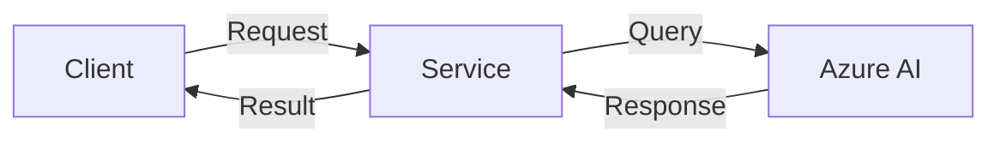

Most common pattern for synchronous operations.

### 2. Fan-Out Flow

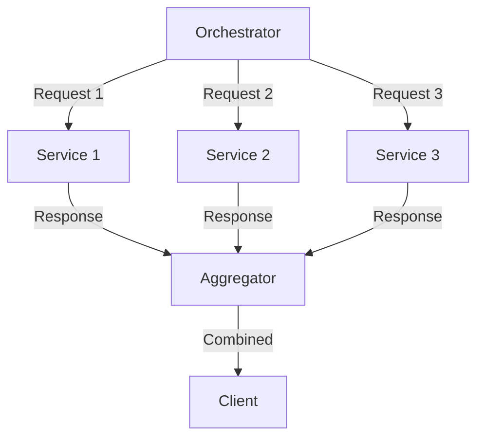

Used for parallel processing and concurrent operations.

### 3. Chain Flow

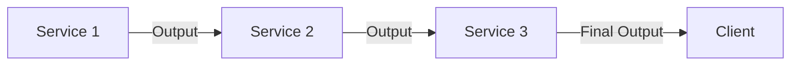

Used for sequential dependencies.

### 4. Hub-and-Spoke Flow

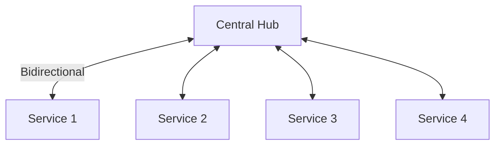

Multi-Agent Demo acts as hub for agent coordination.

## Error Handling and Retries

### Retry Policy

Services implement retry policies for transient failures:

```csharp
services.AddHttpClient("inventoryservice")
    .AddPolicyHandler(GetRetryPolicy());

static IAsyncPolicy<HttpResponseMessage> GetRetryPolicy()
{
    return HttpPolicyExtensions
        .HandleTransientHttpError()
        .WaitAndRetryAsync(3, retryAttempt => 
            TimeSpan.FromSeconds(Math.Pow(2, retryAttempt)));
}
```

### Circuit Breaker

Prevent cascading failures:

```csharp
services.AddHttpClient("inventoryservice")
    .AddPolicyHandler(GetCircuitBreakerPolicy());

static IAsyncPolicy<HttpResponseMessage> GetCircuitBreakerPolicy()
{
    return HttpPolicyExtensions
        .HandleTransientHttpError()
        .CircuitBreakerAsync(5, TimeSpan.FromSeconds(30));
}
```

### Error Response Format

```json
{
  "error": {
    "code": "INVENTORY_UNAVAILABLE",
    "message": "Unable to check inventory",
    "details": "Service temporarily unavailable",
    "correlationId": "7b3f8a2c-9e1d-4f6b-a5c3-8d9e2f1a3b4c",
    "timestamp": "2025-10-23T10:30:00Z"
  }
}
```

## Observability and Tracing

### Distributed Tracing

All requests include correlation IDs for end-to-end tracing:

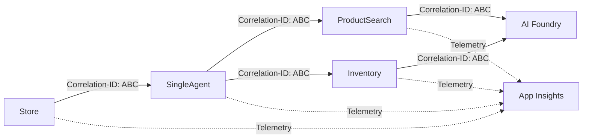

### Telemetry Data

Each service emits:

1. **Traces**: Request flow and timing
2. **Metrics**: Performance counters
3. **Logs**: Detailed operation logs
4. **Dependencies**: External service calls

### Application Insights Query

View complete request flow:

```kusto
traces
| where operation_Id == "7b3f8a2c-9e1d-4f6b-a5c3-8d9e2f1a3b4c"
| project timestamp, message, severityLevel, cloud_RoleName
| order by timestamp asc
```

## Authentication and Authorization

### Service-to-Service Auth

Services authenticate using:
- **Development**: No auth (trusted network)
- **Production**: Managed Identity or API Keys

```csharp
// Production authentication
services.AddHttpClient("inventoryservice", client => {
    client.BaseAddress = new Uri(config["Services:Inventory"]);
})
.AddHttpMessageHandler<AuthenticationHandler>();
```

### Azure AI Foundry Auth

Connection to Azure AI Foundry uses:
- **Development**: Connection string from user secrets
- **Production**: Managed Identity

```csharp
var credential = new DefaultAzureCredential();
var client = new AIFoundryClient(endpoint, credential);
```

## Performance Optimization

### Caching

Results cached where appropriate:

```csharp
[ResponseCache(Duration = 300)] // 5 minutes
public async Task<IActionResult> GetProducts()
{
    return Ok(await _productService.GetAll());
}
```

### Connection Pooling

HTTP clients use connection pooling:

```csharp
services.AddHttpClient("inventoryservice")
    .ConfigurePrimaryHttpMessageHandler(() => new HttpClientHandler
    {
        MaxConnectionsPerServer = 10
    });
```

### Async/Await

All I/O operations are asynchronous:

```csharp
public async Task<Result> ProcessAsync()
{
    var task1 = Service1.CallAsync();
    var task2 = Service2.CallAsync();
    await Task.WhenAll(task1, task2);
    return Combine(task1.Result, task2.Result);
}
```

## Rate Limiting

Services implement rate limiting:

```csharp
app.UseRateLimiter(new RateLimiterOptions
{
    GlobalLimiter = PartitionedRateLimiter.Create<HttpContext, string>(context =>
        RateLimitPartition.GetFixedWindowLimiter(
            partitionKey: context.User.Identity?.Name ?? "anonymous",
            factory: _ => new FixedWindowRateLimiterOptions
            {
                PermitLimit = 100,
                Window = TimeSpan.FromMinutes(1)
            }))
});
```

## Next Steps

- [API Reference](04-api-reference.md) - Detailed API specifications
- [Data Flow](05-data-flow.md) - Data models and transformations
- [Deployment Architecture](06-deployment-architecture.md) - Production deployment
