# Data Flow

This document explains how data flows through the application, including data models, transformations, and storage.

## Data Flow Overview

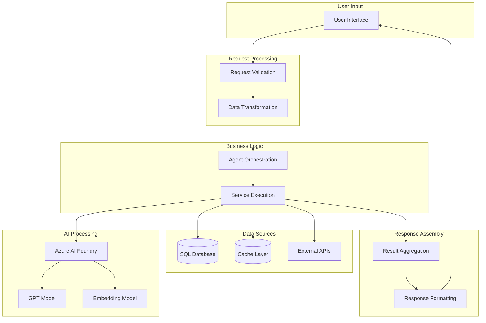

## Data Models

### Core Domain Models

#### Product Model

```csharp
public class Product
{
    public string Id { get; set; }
    public string Name { get; set; }
    public string Description { get; set; }
    public decimal Price { get; set; }
    public string Category { get; set; }
    public string ImageUrl { get; set; }
    public ProductSpecifications Specifications { get; set; }
    public bool InStock { get; set; }
    public int StockQuantity { get; set; }
    public DateTime CreatedAt { get; set; }
    public DateTime UpdatedAt { get; set; }
}

public class ProductSpecifications
{
    public Dictionary<string, string> Attributes { get; set; }
}
```

#### Customer Model

```csharp
public class Customer
{
    public string Id { get; set; }
    public string Name { get; set; }
    public string Email { get; set; }
    public DateTime MemberSince { get; set; }
    public string Tier { get; set; } // standard, gold, platinum
    public CustomerPreferences Preferences { get; set; }
    public List<Order> PurchaseHistory { get; set; }
}

public class CustomerPreferences
{
    public List<string> FavoriteCategories { get; set; }
    public List<string> FavoriteBrands { get; set; }
    public PriceRange PreferredPriceRange { get; set; }
    public NotificationSettings Notifications { get; set; }
}
```

#### Inventory Model

```csharp
public class InventoryItem
{
    public string ProductId { get; set; }
    public bool Available { get; set; }
    public int TotalQuantity { get; set; }
    public List<StoreInventory> Stores { get; set; }
    public DateTime LastUpdated { get; set; }
}

public class StoreInventory
{
    public string StoreId { get; set; }
    public string StoreName { get; set; }
    public int Quantity { get; set; }
    public bool Reservable { get; set; }
    public ProductLocation Location { get; set; }
}

public class ProductLocation
{
    public string Aisle { get; set; }
    public string Section { get; set; }
    public string Shelf { get; set; }
}
```

#### Store Model

```csharp
public class Store
{
    public string Id { get; set; }
    public string Name { get; set; }
    public Address Address { get; set; }
    public GeoCoordinates Coordinates { get; set; }
    public ContactInfo Contact { get; set; }
    public StoreHours Hours { get; set; }
    public List<string> Services { get; set; }
}

public class GeoCoordinates
{
    public decimal Latitude { get; set; }
    public decimal Longitude { get; set; }
}
```

### Agent Request/Response Models

#### Agent Request

```csharp
public class AgentRequest
{
    public string Query { get; set; }
    public string CustomerId { get; set; }
    public Dictionary<string, object> Context { get; set; }
    public AgentOptions Options { get; set; }
    public string CorrelationId { get; set; }
}

public class AgentOptions
{
    public int MaxResults { get; set; } = 10;
    public bool IncludeInventory { get; set; } = true;
    public bool IncludeRecommendations { get; set; } = false;
    public TimeSpan Timeout { get; set; } = TimeSpan.FromSeconds(30);
}
```

#### Agent Response

```csharp
public class AgentResponse
{
    public bool Success { get; set; }
    public List<AgentResult> Results { get; set; }
    public string Reasoning { get; set; }
    public AgentMetadata Metadata { get; set; }
    public string CorrelationId { get; set; }
}

public class AgentResult
{
    public Product Product { get; set; }
    public InventoryItem Inventory { get; set; }
    public decimal RelevanceScore { get; set; }
    public List<Store> NearbyStores { get; set; }
}

public class AgentMetadata
{
    public string AgentId { get; set; }
    public string Framework { get; set; } // "SK" or "AgentFx"
    public TimeSpan ExecutionTime { get; set; }
    public List<ToolExecution> ToolsUsed { get; set; }
    public int TokensUsed { get; set; }
}
```

### AI Foundry Integration Models

#### Agent Configuration

```csharp
public class AIFoundryAgentConfig
{
    public string AgentId { get; set; }
    public string ProjectId { get; set; }
    public string DeploymentName { get; set; }
    public string Instructions { get; set; }
    public List<ToolDefinition> Tools { get; set; }
    public Dictionary<string, string> Parameters { get; set; }
}

public class ToolDefinition
{
    public string Name { get; set; }
    public string Description { get; set; }
    public Dictionary<string, ParameterSchema> Parameters { get; set; }
}
```

#### Agent Execution

```csharp
public class AgentExecution
{
    public string ThreadId { get; set; }
    public string RunId { get; set; }
    public List<Message> Messages { get; set; }
    public List<ToolCall> ToolCalls { get; set; }
    public AgentStatus Status { get; set; }
    public DateTime StartedAt { get; set; }
    public DateTime CompletedAt { get; set; }
}

public class ToolCall
{
    public string ToolName { get; set; }
    public Dictionary<string, object> Arguments { get; set; }
    public object Result { get; set; }
    public TimeSpan Duration { get; set; }
}
```

## Data Transformations

### Request Pipeline

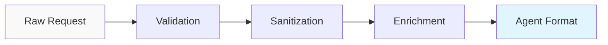

#### 1. Validation
- Schema validation
- Required field checks
- Data type verification
- Range checks

#### 2. Sanitization
- Input cleaning
- XSS prevention
- SQL injection prevention
- Normalization

#### 3. Enrichment
- Add correlation ID
- Add timestamp
- Add user context
- Add metadata

#### 4. Agent Format Conversion
- Convert to agent-specific format
- Add agent instructions
- Prepare context

### Response Pipeline

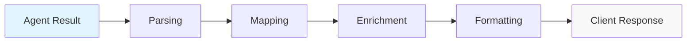

#### 1. Parsing
- Extract structured data
- Parse JSON responses
- Handle errors

#### 2. Mapping
- Map to domain models
- Convert data types
- Apply transformations

#### 3. Enrichment
- Add related data
- Compute derived fields
- Add metadata

#### 4. Formatting
- Apply client-specific format
- Add HATEOAS links
- Optimize payload size

## Search Data Flow

### Semantic Search Process

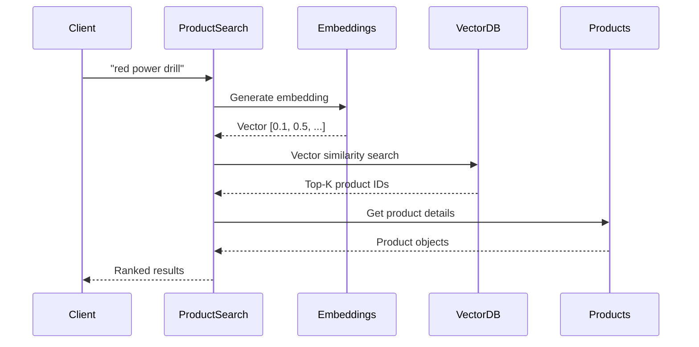

### Vector Embedding

```csharp
public class VectorEmbedding
{
    public string Id { get; set; }
    public string Text { get; set; }
    public float[] Vector { get; set; } // 1536 dimensions
    public string EntityType { get; set; } // "product", "description"
    public string EntityId { get; set; }
    public Dictionary<string, string> Metadata { get; set; }
}
```

### Search Result Ranking

```csharp
public class SearchResult
{
    public Product Product { get; set; }
    public float VectorScore { get; set; } // 0.0 - 1.0
    public float KeywordScore { get; set; } // 0.0 - 1.0
    public float PopularityScore { get; set; } // 0.0 - 1.0
    public float FinalScore { get; set; } // Weighted combination
}

// Scoring formula
FinalScore = (VectorScore * 0.6) + (KeywordScore * 0.3) + (PopularityScore * 0.1)
```

## Image Analysis Data Flow

### Image Processing Pipeline

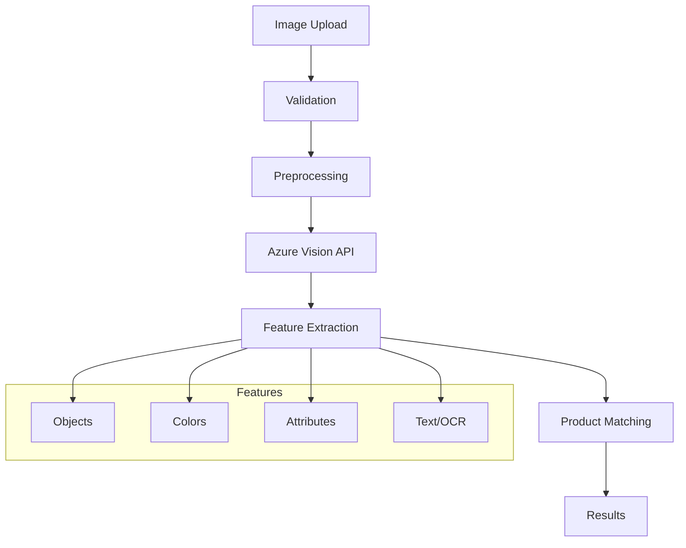

### Image Analysis Result

```csharp
public class ImageAnalysisResult
{
    public string ImageId { get; set; }
    public List<DetectedObject> DetectedObjects { get; set; }
    public List<Color> DominantColors { get; set; }
    public Dictionary<string, string> Attributes { get; set; }
    public List<string> DetectedText { get; set; }
    public ProductMatch BestMatch { get; set; }
    public List<ProductMatch> SimilarProducts { get; set; }
}

public class DetectedObject
{
    public string Name { get; set; }
    public float Confidence { get; set; }
    public BoundingBox Box { get; set; }
}

public class ProductMatch
{
    public string ProductId { get; set; }
    public float Confidence { get; set; }
    public List<string> MatchedFeatures { get; set; }
}
```

## Recommendation Data Flow

### Collaborative Filtering

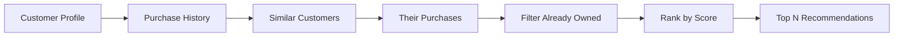

### Content-Based Filtering

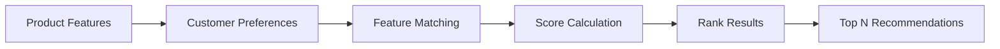

### Recommendation Model

```csharp
public class Recommendation
{
    public Product Product { get; set; }
    public float Score { get; set; }
    public RecommendationReason Reason { get; set; }
    public RecommendationSource Source { get; set; }
}

public enum RecommendationSource
{
    CollaborativeFiltering,
    ContentBased,
    Trending,
    PersonalizedPromotions,
    FrequentlyBoughtTogether
}

public class RecommendationReason
{
    public string PrimaryReason { get; set; }
    public List<string> ContributingFactors { get; set; }
    public float Confidence { get; set; }
}
```

## Caching Strategy

### Cache Layers

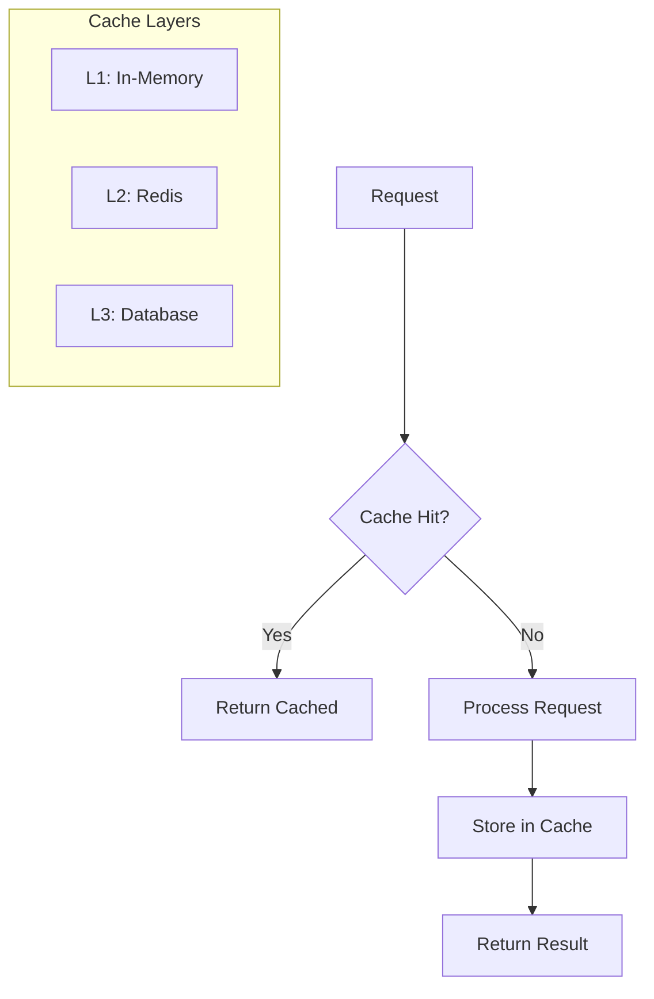

### Cached Data Types

| Data Type | TTL | Strategy |
|-----------|-----|----------|
| Product Catalog | 1 hour | Write-through |
| Inventory | 5 minutes | Write-through |
| Customer Profile | 30 minutes | Lazy load |
| Search Results | 15 minutes | Time-based |
| Recommendations | 1 hour | Lazy load |
| Store Information | 24 hours | Write-through |

### Cache Key Format

```
{service}:{entity}:{id}:{version}

Examples:
products:product:1:v1
inventory:product:1:store-1:v1
customer:profile:cust-123:v1
search:query:red-drill:v1
```

## Data Persistence

### Database Schema

```sql
-- Products Table
CREATE TABLE Products (
    Id VARCHAR(50) PRIMARY KEY,
    Name VARCHAR(200) NOT NULL,
    Description TEXT,
    Price DECIMAL(10,2) NOT NULL,
    Category VARCHAR(100),
    ImageUrl VARCHAR(500),
    InStock BIT DEFAULT 1,
    StockQuantity INT DEFAULT 0,
    CreatedAt DATETIME2 DEFAULT GETUTCDATE(),
    UpdatedAt DATETIME2 DEFAULT GETUTCDATE()
);

-- Product Specifications
CREATE TABLE ProductSpecifications (
    Id INT IDENTITY(1,1) PRIMARY KEY,
    ProductId VARCHAR(50) FOREIGN KEY REFERENCES Products(Id),
    AttributeName VARCHAR(100),
    AttributeValue VARCHAR(500)
);

-- Customers (Mock Data)
CREATE TABLE Customers (
    Id VARCHAR(50) PRIMARY KEY,
    Name VARCHAR(200),
    Email VARCHAR(200),
    MemberSince DATETIME2,
    Tier VARCHAR(20)
);

-- Vector Embeddings
CREATE TABLE VectorEmbeddings (
    Id VARCHAR(50) PRIMARY KEY,
    EntityType VARCHAR(50),
    EntityId VARCHAR(50),
    Vector VARBINARY(MAX), -- Serialized float array
    CreatedAt DATETIME2 DEFAULT GETUTCDATE()
);
```

### Data Migration Flow

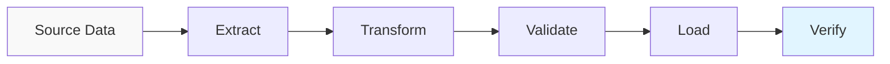

## Telemetry Data Flow

### Observability Pipeline

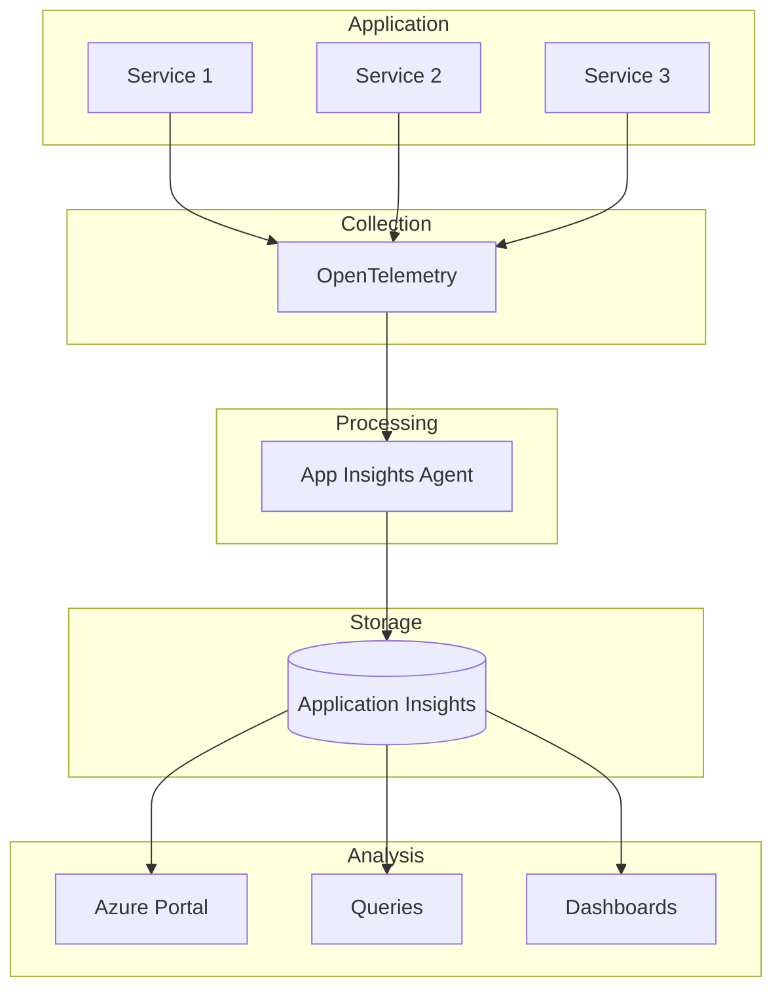

### Telemetry Models

```csharp
public class RequestTelemetry
{
    public string CorrelationId { get; set; }
    public string ServiceName { get; set; }
    public string Operation { get; set; }
    public DateTime StartTime { get; set; }
    public TimeSpan Duration { get; set; }
    public bool Success { get; set; }
    public int StatusCode { get; set; }
    public Dictionary<string, string> Properties { get; set; }
    public Dictionary<string, double> Metrics { get; set; }
}

public class DependencyTelemetry
{
    public string CorrelationId { get; set; }
    public string DependencyType { get; set; } // HTTP, SQL, AI
    public string Target { get; set; }
    public string Command { get; set; }
    public DateTime StartTime { get; set; }
    public TimeSpan Duration { get; set; }
    public bool Success { get; set; }
    public string ResultCode { get; set; }
}
```

## Data Security

### Sensitive Data Handling

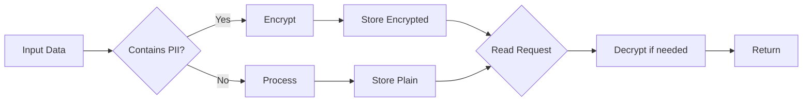

### PII Protection

- Customer names: Masked in logs
- Email addresses: Hashed in analytics
- Payment info: Not stored
- API keys: Stored in Key Vault
- Connection strings: Environment variables

## Performance Optimization

### Data Loading Patterns

**Eager Loading**: Load related data upfront
```csharp
var products = db.Products
    .Include(p => p.Specifications)
    .Include(p => p.Category)
    .ToList();
```

**Lazy Loading**: Load data on demand
```csharp
var product = db.Products.Find(id);
// Specifications loaded when accessed
var specs = product.Specifications;
```

**Pagination**: Load data in chunks
```csharp
var page = await products
    .Skip((pageNumber - 1) * pageSize)
    .Take(pageSize)
    .ToListAsync();
```

### Query Optimization

- Use indexes on frequently queried fields
- Avoid N+1 query problems
- Use projection to select only needed fields
- Implement query result caching
- Use async operations

## Next Steps

- [Deployment Architecture](06-deployment-architecture.md) - Production infrastructure
- [Developer Guide](08-developer-guide.md) - Implementation details
