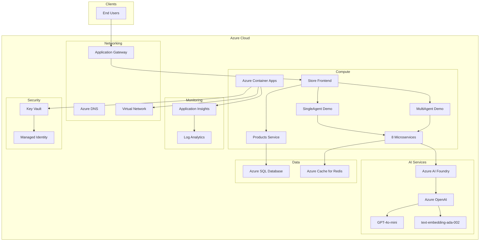
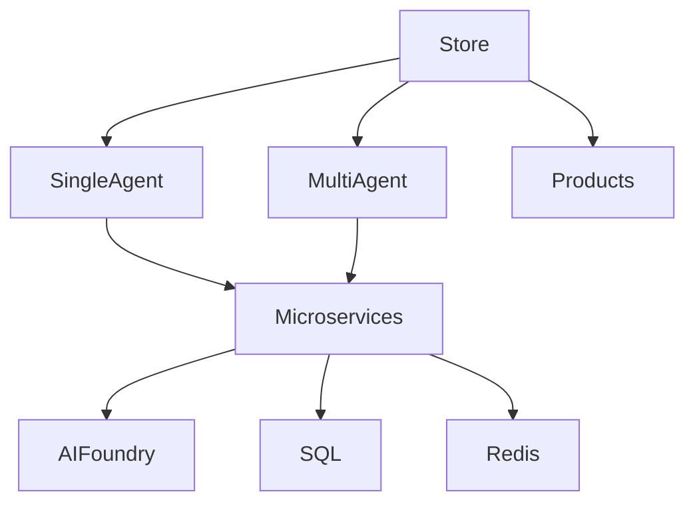

# Deployment Architecture

This document describes the production deployment architecture and infrastructure setup.

## Deployment Overview



## Infrastructure Components

### 1. Azure Container Apps

**Purpose**: Host all microservices and frontend

**Configuration**:
- **Environment**: Single Container Apps Environment
- **Scaling**: Autoscaling based on HTTP requests and CPU
- **Ingress**: Internal for microservices, external for frontend
- **Revision Mode**: Single revision with zero-downtime deployment

**Services Deployed**:
1. Store Frontend (Public ingress)
2. Single Agent Demo (Internal ingress)
3. Multi-Agent Demo (Internal ingress)
4. Agent Catalog Service (Internal ingress)
5. Products Service (Internal ingress)
6. Analyze Photo Service (Internal ingress)
7. Customer Information Service (Internal ingress)
8. Inventory Service (Internal ingress)
9. Location Service (Internal ingress)
10. Matchmaking Service (Internal ingress)
11. Navigation Service (Internal ingress)
12. Product Search Service (Internal ingress)
13. Tool Reasoning Service (Internal ingress)

**Scaling Configuration**:
```yaml
scale:
  minReplicas: 1
  maxReplicas: 10
  rules:
    - name: http-scaling
      http:
        metadata:
          concurrentRequests: 50
    - name: cpu-scaling
      custom:
        type: cpu
        metadata:
          type: Utilization
          value: "70"
```

### 2. Azure AI Foundry

**Purpose**: AI agent management and deployment

**Components**:
- **Project**: Central AI project
- **Hub**: Resource management hub
- **Agents**: 8 specialized agents
- **Deployments**: GPT and embedding models

**Agent Configuration**:
```json
{
  "agents": [
    {
      "name": "PhotoAnalyzer",
      "model": "gpt-4o-mini",
      "instructions": "Analyze product images...",
      "tools": ["vision", "object-detection"]
    },
    {
      "name": "ProductSearch",
      "model": "gpt-4o-mini",
      "instructions": "Semantic product search...",
      "tools": ["search", "embeddings"]
    }
  ]
}
```

### 3. Azure OpenAI Service

**Purpose**: LLM and embedding models

**Deployments**:

**GPT-4o-mini**:
- Model: gpt-4o-mini
- Version: 2025-08-07
- Deployment: gpt-5-mini
- SKU: GlobalStandard
- TPM: 150K tokens per minute
- RPM: 1K requests per minute

**Text Embeddings**:
- Model: text-embedding-ada-002
- Version: 2
- Dimensions: 1536
- TPM: 350K tokens per minute

### 4. Azure SQL Database

**Purpose**: Persistent data storage

**Configuration**:
- **Tier**: General Purpose
- **Compute**: Serverless (auto-pause enabled)
- **vCores**: 2-8 (auto-scaling)
- **Storage**: 32 GB (max 1 TB)
- **Backup**: 7-day point-in-time restore
- **Geo-Replication**: Optional for production

**Databases**:
- `productsdb` - Product catalog and related data

**Security**:
- Private endpoint enabled
- TLS 1.2+ required
- Azure AD authentication
- Firewall rules for Container Apps

### 5. Azure Cache for Redis

**Purpose**: Distributed caching

**Configuration**:
- **Tier**: Standard
- **Capacity**: C1 (1 GB)
- **Clustering**: Disabled
- **Persistence**: AOF enabled
- **Max Memory Policy**: allkeys-lru

**Cache Usage**:
- Product catalog (1 hour TTL)
- Search results (15 minutes TTL)
- Customer profiles (30 minutes TTL)
- Inventory data (5 minutes TTL)

### 6. Application Insights

**Purpose**: Monitoring and diagnostics

**Features Enabled**:
- Distributed tracing
- Custom metrics
- Log aggregation
- Live metrics stream
- Availability tests
- Smart detection

**Retention**: 90 days

**Sampling**: Adaptive (preserves failures)

### 7. Log Analytics Workspace

**Purpose**: Centralized logging

**Configuration**:
- **Retention**: 30 days
- **Daily Cap**: 10 GB
- **Pricing Tier**: Pay-as-you-go

**Log Sources**:
- Application Insights
- Container Apps logs
- Azure AI Foundry logs
- SQL Database diagnostics

### 8. Azure Key Vault

**Purpose**: Secrets management

**Stored Secrets**:
- Azure OpenAI API keys
- SQL connection strings
- Redis connection strings
- AI Foundry project keys
- Agent IDs

**Access Policy**:
- Managed Identity: Read secrets
- DevOps Pipeline: Read/Write secrets
- Admin: Full access

### 9. Managed Identity

**Purpose**: Secure authentication

**Services Using Managed Identity**:
- Container Apps → Key Vault
- Container Apps → Azure OpenAI
- Container Apps → SQL Database
- Container Apps → Redis
- Container Apps → AI Foundry

**Benefits**:
- No credentials in code
- Automatic rotation
- Azure AD integration
- Least privilege access

### 10. Virtual Network

**Purpose**: Network isolation

**Subnets**:
- Container Apps subnet
- Private endpoints subnet
- Gateway subnet

**Network Security Groups**:
- Allow HTTPS from internet to Gateway
- Allow internal traffic between services
- Deny all other traffic

### 11. Application Gateway

**Purpose**: Load balancing and WAF

**Configuration**:
- **SKU**: WAF v2
- **Capacity**: Auto-scaling (2-10 instances)
- **Rules**: Path-based routing
- **SSL**: TLS 1.2+
- **WAF**: OWASP Core Rule Set 3.2

**Routing Rules**:
```
/ → Store Frontend
/api/products → Products Service
/api/singleagent → Single Agent Demo
/api/multiagent → Multi-Agent Demo
```

## Deployment Process

### Automated Deployment with Azure Developer CLI

```bash
# Login to Azure
azd auth login

# Initialize project
azd init

# Provision infrastructure
azd provision

# Deploy application
azd deploy

# Full deployment
azd up
```

### Manual Deployment Steps

#### 1. Resource Group Creation
```bash
az group create \
  --name rg-aitour-brk445 \
  --location eastus
```

#### 2. AI Foundry Setup
```bash
# Create AI Foundry hub
az ml workspace create \
  --name aihub-brk445 \
  --resource-group rg-aitour-brk445

# Create AI Foundry project
az ml workspace create \
  --name aiproject-brk445 \
  --resource-group rg-aitour-brk445 \
  --hub aihub-brk445
```

#### 3. Azure OpenAI Deployment
```bash
# Create OpenAI resource
az cognitiveservices account create \
  --name openai-brk445 \
  --resource-group rg-aitour-brk445 \
  --kind OpenAI \
  --sku S0 \
  --location eastus

# Deploy GPT model
az cognitiveservices account deployment create \
  --name openai-brk445 \
  --resource-group rg-aitour-brk445 \
  --deployment-name gpt-5-mini \
  --model-name gpt-4o-mini \
  --model-version "2025-08-07" \
  --sku-name "GlobalStandard"

# Deploy embedding model
az cognitiveservices account deployment create \
  --name openai-brk445 \
  --resource-group rg-aitour-brk445 \
  --deployment-name text-embedding-ada-002 \
  --model-name text-embedding-ada-002 \
  --model-version "2"
```

#### 4. SQL Database Setup
```bash
# Create SQL Server
az sql server create \
  --name sql-brk445 \
  --resource-group rg-aitour-brk445 \
  --admin-user sqladmin \
  --admin-password <secure-password>

# Create database
az sql db create \
  --name productsdb \
  --server sql-brk445 \
  --resource-group rg-aitour-brk445 \
  --compute-model Serverless \
  --edition GeneralPurpose \
  --family Gen5 \
  --capacity 2
```

#### 5. Container Apps Environment
```bash
# Create environment
az containerapp env create \
  --name env-brk445 \
  --resource-group rg-aitour-brk445 \
  --location eastus

# Deploy Store app
az containerapp create \
  --name store \
  --resource-group rg-aitour-brk445 \
  --environment env-brk445 \
  --image <acr-url>/store:latest \
  --target-port 8080 \
  --ingress external \
  --min-replicas 1 \
  --max-replicas 10
```

## Environment Configuration

### Development
```bash
export ASPNETCORE_ENVIRONMENT=Development
export ConnectionStrings__aifoundry="<connection-string>"
export ConnectionStrings__productsDb="<connection-string>"
export ConnectionStrings__redis="<connection-string>"
```

### Staging
```bash
export ASPNETCORE_ENVIRONMENT=Staging
export ConnectionStrings__aifoundry="<connection-string>"
export ConnectionStrings__productsDb="<connection-string>"
export ConnectionStrings__redis="<connection-string>"
export ApplicationInsights__ConnectionString="<connection-string>"
```

### Production
- All secrets from Key Vault
- Managed Identity for authentication
- Network isolation enabled
- WAF enabled
- Auto-scaling enabled

## High Availability

### Service Redundancy
- Multiple replicas per service
- Auto-healing enabled
- Health checks configured
- Load balancing

### Data Redundancy
- SQL Database geo-replication
- Redis persistence
- Regular backups
- Point-in-time restore

### Disaster Recovery
- RTO: 1 hour
- RPO: 5 minutes
- Automated failover
- Regular DR drills

## Monitoring and Alerts

### Health Checks

```csharp
// Health check configuration
builder.Services.AddHealthChecks()
    .AddSqlServer(connectionString)
    .AddRedis(redisConnection)
    .AddCheck<AIFoundryHealthCheck>("aifoundry");

app.MapHealthChecks("/health");
app.MapHealthChecks("/health/ready", new HealthCheckOptions
{
    Predicate = check => check.Tags.Contains("ready")
});
```

### Alerts

**Critical Alerts**:
- Service unavailable (5+ minutes)
- High error rate (>5% of requests)
- Database connection failures
- AI Foundry quota exceeded

**Warning Alerts**:
- High response time (>5 seconds p95)
- High CPU usage (>80%)
- High memory usage (>80%)
- Slow queries (>3 seconds)

### Application Map



## Security Configuration

### Network Security
- Private endpoints for all data services
- VNet integration for Container Apps
- NSG rules for traffic control
- WAF protection

### Identity and Access
- Managed Identity for service auth
- Azure AD for user auth
- RBAC for resource access
- Just-in-time access for admins

### Data Protection
- TLS 1.2+ in transit
- Encryption at rest (all data)
- Key rotation (90 days)
- PII masking in logs

### Compliance
- GDPR compliance
- SOC 2 compliance
- Regular security audits
- Penetration testing

## Cost Optimization

### Resource Costs (Estimated Monthly)

| Resource | Configuration | Est. Cost |
|----------|--------------|-----------|
| Container Apps | 10 services, auto-scale | $200 |
| Azure OpenAI | Standard tier, 1M tokens | $150 |
| AI Foundry | Project + 8 agents | $100 |
| SQL Database | Serverless, 2-8 vCores | $150 |
| Redis Cache | Standard C1 | $75 |
| Application Insights | 10GB/month | $25 |
| Application Gateway | WAF v2 | $125 |
| **Total** | | **~$825/month** |

### Cost Optimization Strategies

1. **Auto-scaling**: Scale down during off-hours
2. **Serverless SQL**: Auto-pause when idle
3. **Reserved Capacity**: For production OpenAI
4. **Spot Instances**: For non-critical workloads
5. **Efficient Caching**: Reduce AI API calls
6. **Query Optimization**: Reduce database costs

## Performance Targets

| Metric | Target | Critical |
|--------|--------|----------|
| Response Time (p50) | <1s | <3s |
| Response Time (p95) | <3s | <10s |
| Availability | >99.9% | >99% |
| Error Rate | <1% | <5% |
| Time to First Byte | <200ms | <500ms |

## Backup and Recovery

### Backup Strategy
- **SQL Database**: Automated backups, 7-day retention
- **Configuration**: Stored in Git repository
- **Secrets**: Backed up in Key Vault
- **Application Insights**: 90-day retention

### Recovery Procedures
1. Detect issue via monitoring
2. Assess impact and scope
3. Execute recovery plan
4. Verify system health
5. Document incident

## Next Steps

- [Getting Started](07-getting-started.md) - Development setup
- [Developer Guide](08-developer-guide.md) - Development practices
