# Descripción General de la Arquitectura

## Arquitectura del Sistema

Esta aplicación demuestra patrones de agentes de IA listos para empresas usando Azure AI Foundry, .NET Aspire y una arquitectura de microservicios.

## Diagrama de Arquitectura de Alto Nivel

```mermaid
graph TB
    subgraph "Capa de Cliente"
        Store[Store - Frontend Blazor]
    end
    
    subgraph "Orquestación .NET Aspire"
        AppHost[ZavaAppHost - Orquestador de Servicios]
    end
    
    subgraph "Servicios de Demostración de Agentes"
        SingleAgent[Demo Agente Único]
        MultiAgent[Demo Multi-Agente]
        AgentCatalog[Servicio Catálogo de Agentes]
    end
    
    subgraph "Capa de Microservicios"
        AnalyzePhoto[Servicio de Análisis de Fotos]
        CustomerInfo[Servicio de Información del Cliente]
        Inventory[Servicio de Inventario]
        Location[Servicio de Ubicación]
        Matchmaking[Servicio de Recomendaciones]
        Navigation[Servicio de Navegación]
        ProductSearch[Servicio de Búsqueda de Productos]
        ToolReasoning[Servicio de Razonamiento]
    end
    
    subgraph "Capa de Datos"
        Products[Servicio de Productos]
        SQL[(Base de Datos SQL Server)]
    end
    
    subgraph "Azure AI Foundry"
        AIFoundry[Proyecto AI Foundry]
        GPT[Modelo GPT-4o-mini]
        Embeddings[Modelo de Embeddings]
        Agents[Agentes de AI Foundry]
    end
    
    subgraph "Servicios de Azure"
        AppInsights[Application Insights]
    end
    
    Store --> SingleAgent
    Store --> MultiAgent
    Store --> AgentCatalog
    Store --> Products
    
    SingleAgent --> AnalyzePhoto
    SingleAgent --> CustomerInfo
    SingleAgent --> ToolReasoning
    SingleAgent --> Inventory
    SingleAgent --> ProductSearch
    
    MultiAgent --> AnalyzePhoto
    MultiAgent --> CustomerInfo
    MultiAgent --> ToolReasoning
    MultiAgent --> Inventory
    MultiAgent --> ProductSearch
    MultiAgent --> Matchmaking
    MultiAgent --> Location
    MultiAgent --> Navigation
    
    AgentCatalog --> AnalyzePhoto
    AgentCatalog --> CustomerInfo
    AgentCatalog --> ToolReasoning
    AgentCatalog --> Inventory
    AgentCatalog --> ProductSearch
    AgentCatalog --> Matchmaking
    AgentCatalog --> Location
    AgentCatalog --> Navigation
    
    Products --> SQL
    
    AnalyzePhoto -.-> AIFoundry
    CustomerInfo -.-> AIFoundry
    ToolReasoning -.-> AIFoundry
    Inventory -.-> AIFoundry
    ProductSearch -.-> AIFoundry
    Matchmaking -.-> AIFoundry
    Location -.-> AIFoundry
    Navigation -.-> AIFoundry
    
    AIFoundry --> GPT
    AIFoundry --> Embeddings
    AIFoundry --> Agents
    
    Store -.-> AppInsights
    SingleAgent -.-> AppInsights
    MultiAgent -.-> AppInsights
    AgentCatalog -.-> AppInsights
    AnalyzePhoto -.-> AppInsights
    CustomerInfo -.-> AppInsights
    ToolReasoning -.-> AppInsights
    Inventory -.-> AppInsights
    ProductSearch -.-> AppInsights
    Matchmaking -.-> AppInsights
    Location -.-> AppInsights
    Navigation -.-> AppInsights
    Products -.-> AppInsights
    
    AppHost -.-> Store
    AppHost -.-> SingleAgent
    AppHost -.-> MultiAgent
    AppHost -.-> AgentCatalog
    AppHost -.-> Products
    AppHost -.-> AnalyzePhoto
    AppHost -.-> CustomerInfo
    AppHost -.-> ToolReasoning
    AppHost -.-> Inventory
    AppHost -.-> ProductSearch
    AppHost -.-> Matchmaking
    AppHost -.-> Location
    AppHost -.-> Navigation
```

## Capas de Arquitectura

### 1. Capa de Cliente

**Store (Frontend Blazor)**
- Proporciona la interfaz de usuario para la tienda potenciada por IA
- Soporta demostraciones de Agente Único y Multi-Agente
- Incluye página de configuración para cambiar entre frameworks de agentes
- Construido con Blazor Server para UI web interactiva

### 2. Capa de Orquestación

**.NET Aspire (ZavaAppHost)**
- Orquestación y configuración centralizada de servicios
- Gestiona dependencias y orden de inicio de servicios
- Maneja cadenas de conexión y variables de entorno
- Proporciona descubrimiento de servicios y monitoreo de salud
- Soporta desarrollo local y despliegue en Azure

### 3. Servicios de Demostración de Agentes

**Demo de Agente Único**
- Demuestra flujos de trabajo simples de agentes
- Un único agente coordinando con múltiples herramientas
- Muestra capacidades de búsqueda semántica y análisis de imágenes

**Demo Multi-Agente**
- Demuestra orquestación compleja de múltiples agentes
- Múltiples agentes especializados trabajando juntos
- Patrones de ejecución secuencial y concurrente de agentes
- Escenarios de traspaso y colaboración entre agentes

**Servicio de Catálogo de Agentes**
- Registro central de todos los agentes disponibles
- Proporciona descubrimiento de agentes y metadatos
- Facilita la reutilización de agentes en diferentes escenarios

### 4. Capa de Microservicios

Cada microservicio es un proveedor especializado de herramientas para agentes:

**Servicio de Análisis de Fotos**
- Análisis de imágenes e identificación de productos
- Capacidades de búsqueda visual
- Conectado a Azure AI Vision

**Servicio de Información del Cliente**
- Gestión de perfiles de clientes
- Preferencias e historial de clientes
- Recomendaciones personalizadas

**Servicio de Inventario**
- Consultas de inventario en tiempo real
- Gestión de niveles de stock
- Consultas de disponibilidad de productos

**Servicio de Ubicación**
- Información de ubicación de tiendas
- Datos geográficos y mapeo
- Cálculos de distancia

**Servicio de Recomendaciones**
- Motor de recomendación de productos
- Emparejamiento cliente-producto
- Sugerencias personalizadas

**Servicio de Navegación**
- Navegación dentro de la tienda
- Guía de ubicación de productos
- Optimización de rutas

**Servicio de Búsqueda de Productos**
- Búsqueda semántica de productos
- Consultas en lenguaje natural
- Búsqueda basada en vectores con embeddings

**Servicio de Razonamiento**
- Capacidades de razonamiento complejo
- Resolución de problemas de múltiples pasos
- Selección y orquestación de herramientas

### 5. Capa de Datos

**Servicio de Productos**
- Gestión del catálogo de productos
- Operaciones CRUD de productos
- Búsqueda y filtrado

**Base de Datos SQL Server**
- Almacenamiento persistente para datos de productos
- Gestión de datos relacionales
- Soporta transacciones y consultas

### 6. Azure AI Foundry

**Proyecto AI Foundry**
- Centro central para recursos de IA
- Gestión y despliegue de agentes
- Configuración de modelos

**Modelo GPT-4o-mini**
- Completación de chat
- Comprensión de lenguaje natural
- Razonamiento y generación

**Modelo de Embeddings de Texto (ada-002)**
- Embeddings vectoriales para búsqueda semántica
- Similitud de documentos
- Soporte para RAG (Generación Aumentada por Recuperación)

**Agentes de AI Foundry**
- Agentes especializados para cada servicio
- Pre-configurados con instrucciones y herramientas
- Gestionados en el portal de Azure AI Foundry

### 7. Observabilidad

**Application Insights**
- Rastreo de extremo a extremo
- Monitoreo de rendimiento
- Seguimiento de errores y diagnósticos
- Telemetría y métricas personalizadas

## Patrones de Diseño

### 1. Arquitectura de Microservicios
- Cada servicio tiene una única responsabilidad
- Los servicios son desplegables independientemente
- Acoplamiento flexible a través de APIs HTTP
- Permite escalado horizontal

### 2. Patrón Agente-Herramienta
- Los agentes actúan como coordinadores inteligentes
- Las herramientas proporcionan capacidades específicas
- Los agentes deciden qué herramientas usar
- Las herramientas devuelven datos estructurados

### 3. Patrones de Orquestación

**Orquestación Secuencial**
- Agente A completa → Agente B comienza
- Ejecución de flujo de trabajo lineal
- Usado para operaciones dependientes

**Orquestación Concurrente**
- Múltiples agentes ejecutándose en paralelo
- Resultados agregados al final
- Usado para operaciones independientes

**Orquestación de Traspaso**
- Agente A delega a Agente B
- Contexto preservado entre agentes
- Usado para experiencia especializada

### 4. Descubrimiento de Servicios
- Los servicios se registran con Aspire
- Resolución dinámica de endpoints
- Sin URLs codificadas
- Configuración específica por entorno

### 5. Gestión de Configuración
- Centralizada en ZavaAppHost
- Cadenas de conexión como parámetros
- Configuración específica por entorno
- Manejo seguro de secretos

## Soporte de Frameworks de Agentes

La aplicación soporta dos frameworks de agentes que se pueden cambiar a través de la UI:

### Semantic Kernel (Por Defecto)
- Paquete Microsoft.SemanticKernel
- Rico ecosistema de plugins
- Maduro y estable
- Amplia adopción de la comunidad

### Microsoft Agent Framework
- Paquete Microsoft.Agents.AI
- Framework de nueva generación
- Optimizado para Azure AI Foundry
- Capacidades avanzadas de orquestación

Ambos frameworks:
- Se conectan a los mismos agentes de Azure AI Foundry
- Usan los mismos microservicios
- Soportan las mismas características
- Se pueden cambiar sin cambios de código

## Flujo de Comunicación

### Flujo de Solicitud
1. El usuario interactúa con la UI de Store
2. Store llama al Servicio de Demo de Agente (Único o Multi)
3. El Servicio de Demo de Agente invoca los microservicios apropiados
4. Los microservicios llaman a los agentes de Azure AI Foundry
5. Los agentes de AI Foundry usan modelos GPT para razonar
6. Los resultados fluyen de vuelta a través de la cadena
7. Store muestra los resultados al usuario

### Flujo de Observabilidad
1. Todos los servicios emiten telemetría
2. Application Insights recopila datos
3. Los IDs de correlación rastrean solicitudes a través de servicios
4. El rastreo distribuido muestra la ruta completa
5. Métricas y logs disponibles en Azure Portal

## Stack Tecnológico

### Backend
- **.NET 9** - Framework .NET más reciente
- **.NET Aspire** - Orquestación nativa en la nube
- **C#** - Lenguaje de programación principal
- **ASP.NET Core** - Framework de API Web
- **Entity Framework Core** - Acceso a datos

### Frontend
- **Blazor Server** - UI web interactiva
- **HTML/CSS/JavaScript** - Tecnologías web

### IA/ML
- **Azure AI Foundry** - Plataforma de IA
- **Semantic Kernel** - Opción de framework de agente 1
- **Microsoft Agent Framework** - Opción de framework de agente 2
- **GPT-4o-mini** - Modelo de lenguaje
- **text-embedding-ada-002** - Modelo de embeddings

### Datos
- **SQL Server** - Base de datos relacional
- **Docker** - Tiempo de ejecución de contenedores

### Observabilidad
- **Application Insights** - Monitoreo y rastreo
- **OpenTelemetry** - Estándar de telemetría

### DevOps
- **Azure DevOps / GitHub Actions** - CI/CD
- **Docker** - Contenedorización
- **Azure Container Apps** - Alojamiento (producción)

## Consideraciones de Seguridad

1. **Autenticación**: Manejada por integración con Azure AD
2. **Autorización**: Control de acceso basado en roles
3. **Gestión de Secretos**: Azure Key Vault para producción
4. **Seguridad de Red**: Endpoints privados y VNets
5. **Seguridad de Contenido**: Integración con Azure AI Content Safety
6. **Privacidad de Datos**: Manejo de PII y cumplimiento
7. **Seguridad de API**: Tokens de autenticación y limitación de tasa

## Características de Escalabilidad

1. **Escalado Horizontal**: Cada servicio escala independientemente
2. **Balanceo de Carga**: Balanceo de carga integrado de Azure
3. **Caché**: Caché de respuestas donde sea apropiado
4. **Procesamiento Asíncrono**: Operaciones no bloqueantes
5. **Pool de Conexiones**: Uso eficiente de recursos
6. **Limitación de Tasa**: Protege contra sobrecarga

## Opciones de Despliegue

### Desarrollo Local
- Docker Compose
- Orquestación con .NET Aspire
- SQL Server local
- Cadena de conexión a Azure AI Foundry

### Despliegue en Azure
- Azure Container Apps
- Azure SQL Database
- Azure AI Foundry
- Application Insights
- Automatizado a través de azd deploy

## Próximos Pasos

- [Componentes de la Aplicación](02-application-components.md) - Descripciones detalladas de componentes
- [Interacciones de Servicios](03-service-interactions.md) - Cómo se comunican los servicios
- [Guía de Inicio](07-getting-started.md) - Configura tu entorno de desarrollo
