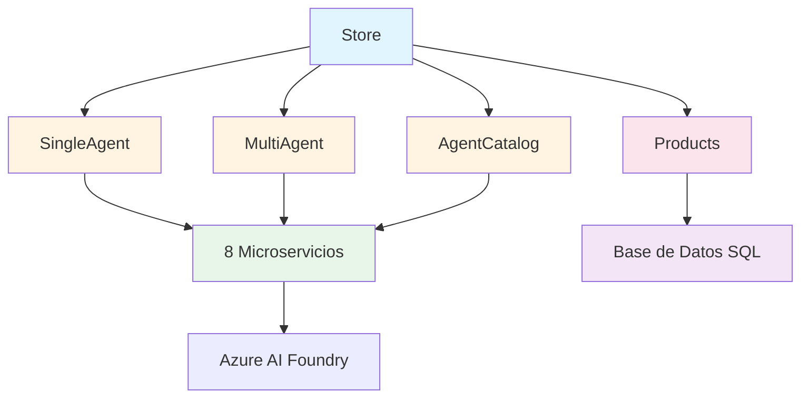

# Componentes de la Aplicación

Este documento proporciona información detallada sobre cada componente en la aplicación.

## Descripción General de Componentes

La aplicación consta de múltiples capas y componentes que trabajan juntos para proporcionar una experiencia de tienda potenciada por IA.

## 1. Componentes Frontend

### Store (Frontend Blazor)

**Ubicación**: `/src/Store/`

**Propósito**: Interfaz de usuario principal para la aplicación de tienda potenciada por IA

**Características Principales**:
- UI interactiva con Blazor Server
- Exploración y búsqueda de productos
- Interfaz de demo de agente único
- Interfaz de demo multi-agente
- Navegador de catálogo de agentes
- Página de configuración para selección de framework

**Dependencias**:
- Servicio de Productos (datos de productos)
- Demo de Agente Único (flujos de trabajo de agente único)
- Demo Multi-Agente (flujos de trabajo multi-agente)
- Servicio de Catálogo de Agentes (descubrimiento de agentes)
- Todos los microservicios (directo e indirecto)

## 2. Componentes de Orquestación

### ZavaAppHost (.NET Aspire)

**Ubicación**: `/src/ZavaAppHost/`

**Propósito**: Centro de orquestación central que gestiona todos los servicios

**Características Principales**:
- Registro y descubrimiento de servicios
- Gestión de dependencias
- Distribución de configuración
- Monitoreo de salud
- Dashboard de desarrollo
- Soporte de despliegue en Azure

**Servicios Gestionados**:
1. SQL Server (contenedor)
2. Base de Datos de Productos
3. Servicio de Productos
4. Frontend de Store
5. Demo de Agente Único
6. Demo Multi-Agente
7. Servicio de Catálogo de Agentes
8. Los 8 microservicios

## 3. Componentes de Demo de Agentes

### Demo de Agente Único

**Ubicación**: `/src/SingleAgentDemo/`

**Propósito**: Demuestra flujos de trabajo de agente único con múltiples herramientas

**Características**:
- Un único agente coordinando múltiples herramientas
- Integración de búsqueda semántica
- Flujos de trabajo de análisis de imágenes
- Recuperación de información del cliente

**Endpoints**:
- `POST /api/singleagent/sk/execute` - Ejecución SK
- `POST /api/singleagent/agentfx/execute` - Ejecución AgentFx

### Demo Multi-Agente

**Ubicación**: `/src/MultiAgentDemo/`

**Propósito**: Demuestra patrones complejos de orquestación multi-agente

**Características**:
- Múltiples agentes especializados
- Colaboración de agentes
- Orquestación secuencial
- Orquestación concurrente
- Patrones de traspaso de agentes

**Endpoints**:
- `POST /api/multiagent/sk/orchestrate` - Orquestación SK
- `POST /api/multiagent/agentfx/orchestrate` - Orquestación AgentFx

### Servicio de Catálogo de Agentes

**Ubicación**: `/src/AgentsCatalogService/`

**Propósito**: Servicio de registro y descubrimiento central para todos los agentes

**Endpoints**:
- `GET /api/agentcatalog` - Listar todos los agentes
- `GET /api/agentcatalog/{agentId}` - Obtener detalles del agente
- `GET /api/agentcatalog/capabilities` - Listar capacidades

## 4. Componentes de Microservicios

### Servicio de Análisis de Fotos
- Análisis de imágenes e identificación de productos
- Búsqueda visual
- Extracción de atributos de imagen

### Servicio de Información del Cliente
- Recuperación de perfil de cliente
- Historial de compras
- Preferencias y favoritos

### Servicio de Inventario
- Consultas de inventario en tiempo real
- Gestión de niveles de stock
- Consultas de disponibilidad de productos

### Servicio de Ubicación
- Información de ubicación de tiendas
- Datos geográficos
- Cálculos de distancia

### Servicio de Recomendaciones
- Motor de recomendación de productos
- Emparejamiento cliente-producto
- Sugerencias personalizadas

### Servicio de Navegación
- Navegación dentro de la tienda
- Guía de ubicación de productos
- Optimización de rutas

### Servicio de Búsqueda de Productos
- Búsqueda semántica de productos
- Consultas en lenguaje natural
- Búsqueda basada en vectores

### Servicio de Razonamiento
- Capacidades de razonamiento complejo
- Resolución de problemas de múltiples pasos
- Selección de herramientas

## 5. Componentes de Datos

### Servicio de Productos

**Ubicación**: `/src/Products/`

**Propósito**: Gestión del catálogo de productos

**Endpoints**:
- `GET /api/products` - Listar todos los productos
- `GET /api/products/{id}` - Obtener producto por ID
- `POST /api/products` - Crear producto
- `PUT /api/products/{id}` - Actualizar producto
- `DELETE /api/products/{id}` - Eliminar producto

### Base de Datos SQL Server

**Tipo**: Contenedor (desarrollo) / Azure SQL (producción)

**Bases de Datos**:
- `productsDb` - Catálogo de productos

**Tablas**:
- Products
- Categories
- Customers (datos simulados)
- Orders (datos simulados)

## Dependencias de Componentes

## Próximos Pasos

- [Interacciones de Servicios](03-service-interactions.md) - Aprende cómo se comunican los componentes
- [Referencia de API](04-api-reference.md) - Documentación detallada de API
