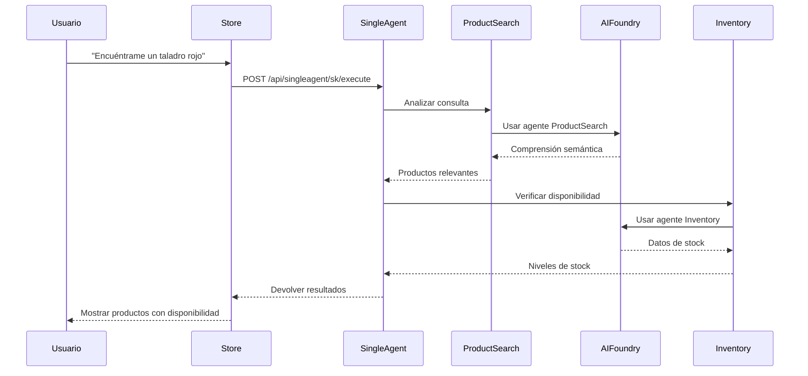
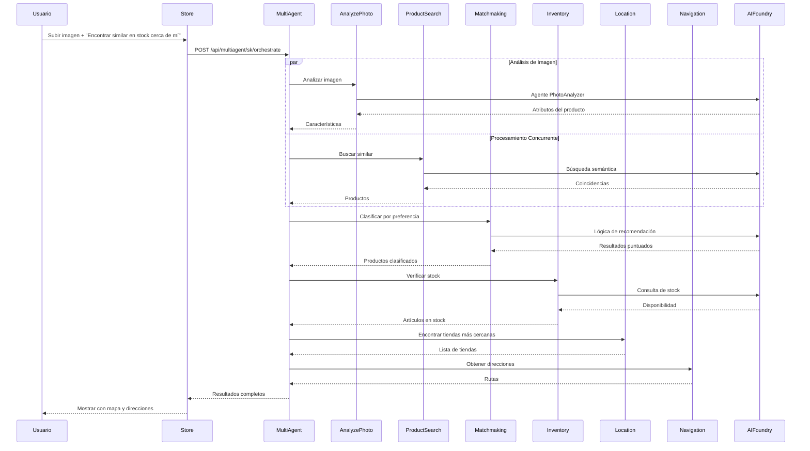
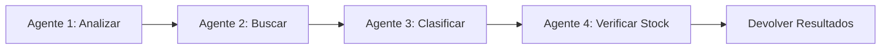
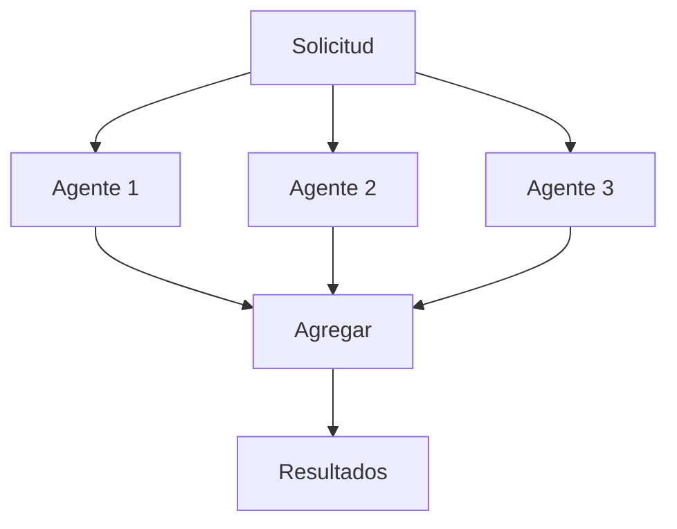
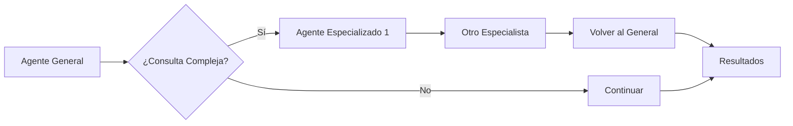
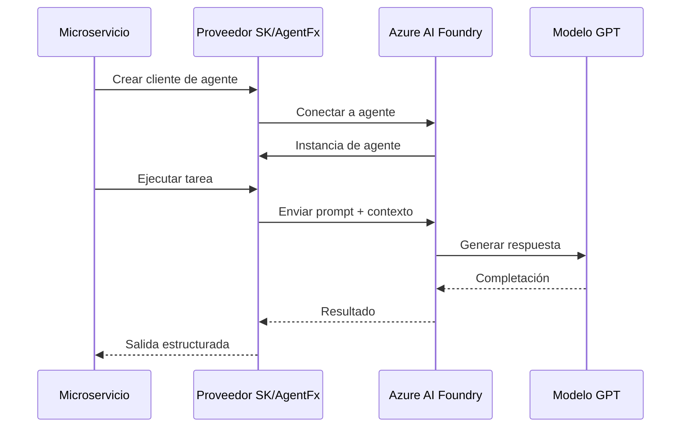

# Interacciones de Servicios

Este documento explica cómo los diferentes servicios se comunican e interactúan entre sí.

## Descripción General de Comunicación

Toda la comunicación entre servicios sigue estos patrones:
- **HTTP/REST** para comunicación servicio-a-servicio
- **SignalR** para actualizaciones de UI en tiempo real
- **Correlación de mensajes** para rastreo distribuido

## Flujo de Trabajo de Agente Único

### Ejemplo: Consulta de Búsqueda de Producto



### Detalles del Flujo de Solicitud

1. **Interacción del Usuario**: El usuario ingresa una consulta en lenguaje natural
2. **Procesamiento de Store**: 
   - Valida la entrada
   - Selecciona framework (SK o AgentFx)
   - Enruta al endpoint apropiado
3. **Coordinación de Agente Único**:
   - Recibe solicitud con ID de correlación
   - Analiza la intención de la consulta
   - Selecciona herramientas/servicios relevantes
   - Llama al servicio ProductSearch
4. **Servicio ProductSearch**:
   - Recibe consulta de búsqueda
   - Llama al agente de Azure AI Foundry
   - El agente usa modelo GPT para comprensión semántica
   - Realiza búsqueda vectorial
   - Devuelve resultados clasificados
5. **Verificación de Inventario**:
   - El Agente Único llama al servicio Inventory
   - El servicio Inventory consulta datos de stock
   - Devuelve disponibilidad para cada producto
6. **Agregación de Resultados**:
   - El Agente Único combina resultados
   - Formatea respuesta
   - Devuelve a Store
7. **Visualización en UI**:
   - Store recibe resultados
   - Renderiza tarjetas de producto
   - Muestra estado de stock

## Flujo de Trabajo Multi-Agente

### Ejemplo: Escenario de Compra Complejo



## Patrones de Orquestación

### 1. Orquestación Secuencial

Cuando los pasos dependen de resultados anteriores:



**Casos de Uso**:
- Búsqueda de producto → Verificación de inventario → Ubicación
- Información del cliente → Personalización → Recomendaciones
- Análisis de imagen → Emparejamiento de producto → Disponibilidad

### 2. Orquestación Concurrente

Cuando las operaciones son independientes:



**Casos de Uso**:
- Obtener información del cliente + inventario + ubicaciones simultáneamente
- Búsqueda paralela de productos en múltiples categorías
- Análisis concurrente de múltiples imágenes

### 3. Orquestación de Traspaso

Cuando se necesita experiencia especializada:



**Casos de Uso**:
- Razonamiento complejo → Agente de herramienta especializada
- Búsqueda general → Agente específico de categoría
- Triage inicial → Agente experto

## Comunicación Servicio-a-Servicio

### Patrón de API REST HTTP

Todos los microservicios exponen APIs REST. Aspire proporciona descubrimiento automático de servicios.

### Encabezados de Solicitud

Todas las llamadas de servicio incluyen:

```http
GET /api/inventory/12345 HTTP/1.1
Host: inventoryservice
X-Correlation-ID: 7b3f8a2c-9e1d-4f6b-a5c3-8d9e2f1a3b4c
Authorization: Bearer <token>
Accept: application/json
```

## Integración con Azure AI Foundry

### Patrón de Invocación de Agente

Cada microservicio se conecta a su agente de Azure AI Foundry:



## Manejo de Errores y Reintentos

Los servicios implementan políticas de reintento para fallos transitorios y disyuntores para prevenir fallos en cascada.

### Formato de Respuesta de Error

```json
{
  "error": {
    "code": "INVENTORY_UNAVAILABLE",
    "message": "No se puede verificar inventario",
    "details": "Servicio temporalmente no disponible",
    "correlationId": "7b3f8a2c-9e1d-4f6b-a5c3-8d9e2f1a3b4c",
    "timestamp": "2025-10-23T10:30:00Z"
  }
}
```

## Observabilidad y Rastreo

### Rastreo Distribuido

Todas las solicitudes incluyen IDs de correlación para rastreo de extremo a extremo. Application Insights recopila telemetría de todos los servicios.

### Consulta de Application Insights

Ver flujo de solicitud completo:

```kusto
traces
| where operation_Id == "7b3f8a2c-9e1d-4f6b-a5c3-8d9e2f1a3b4c"
| project timestamp, message, severityLevel, cloud_RoleName
| order by timestamp asc
```

## Autenticación y Autorización

### Autenticación Servicio-a-Servicio

Los servicios se autentican usando:
- **Desarrollo**: Sin autenticación (red confiable)
- **Producción**: Identidad Administrada o Claves API

## Optimización de Rendimiento

### Almacenamiento en Caché

Resultados almacenados en caché cuando sea apropiado para mejorar el rendimiento.

### Pool de Conexiones

Los clientes HTTP usan pool de conexiones para eficiencia.

### Async/Await

Todas las operaciones de I/O son asíncronas para mejor rendimiento.

## Próximos Pasos

- [Referencia de API](04-api-reference.md) - Especificaciones detalladas de API
- [Flujo de Datos](05-data-flow.md) - Modelos de datos y transformaciones
