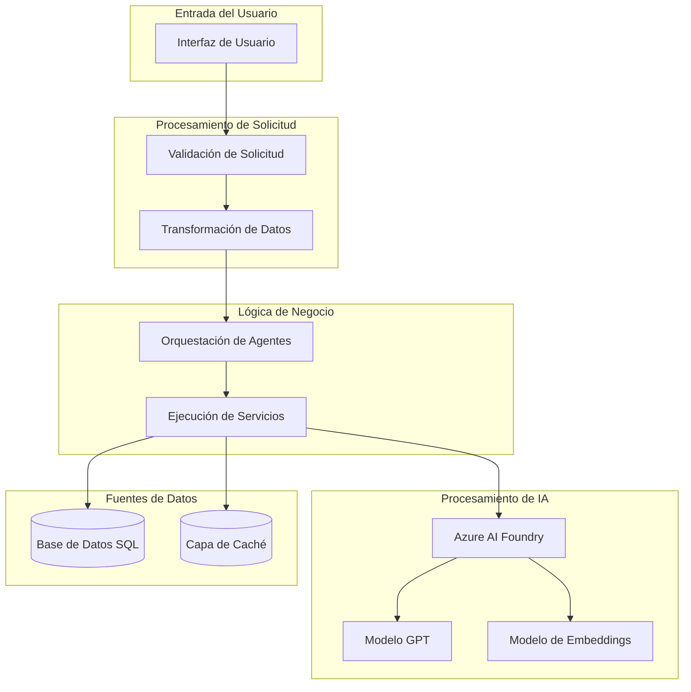
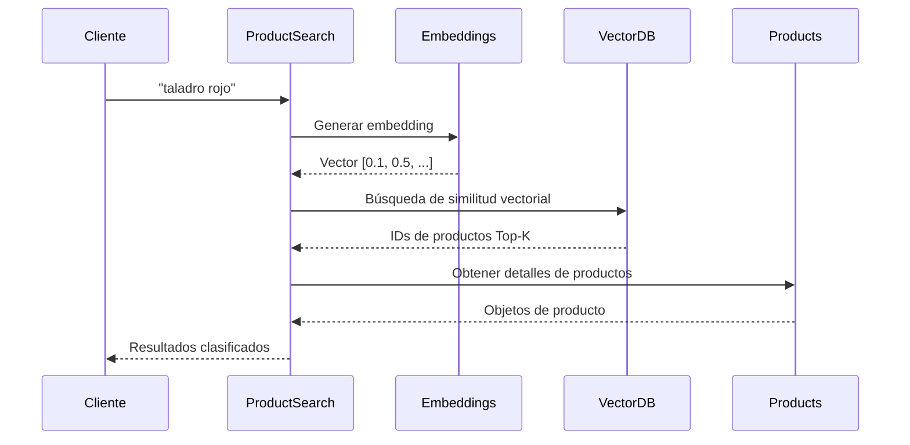
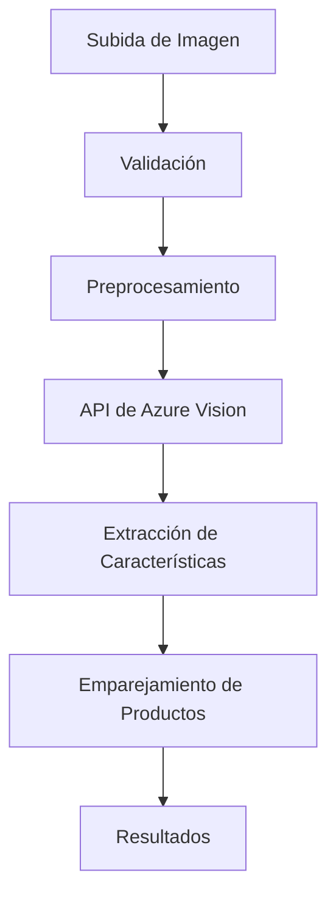
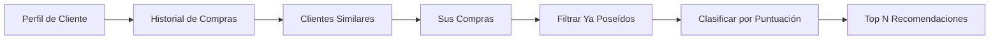

# Flujo de Datos

Este documento explica cómo fluyen los datos a través de la aplicación, incluyendo modelos de datos, transformaciones y almacenamiento.

## Descripción General del Flujo de Datos



## Modelos de Datos

### Modelos de Dominio Principal

#### Modelo de Producto

```csharp
public class Product
{
    public string Id { get; set; }
    public string Name { get; set; }
    public string Description { get; set; }
    public decimal Price { get; set; }
    public string Category { get; set; }
    public bool InStock { get; set; }
    public int StockQuantity { get; set; }
}
```

#### Modelo de Cliente

```csharp
public class Customer
{
    public string Id { get; set; }
    public string Name { get; set; }
    public string Email { get; set; }
    public DateTime MemberSince { get; set; }
    public CustomerPreferences Preferences { get; set; }
}
```

#### Modelo de Inventario

```csharp
public class InventoryItem
{
    public string ProductId { get; set; }
    public bool Available { get; set; }
    public int TotalQuantity { get; set; }
    public List<StoreInventory> Stores { get; set; }
}
```

### Modelos de Solicitud/Respuesta de Agente

#### Solicitud de Agente

```csharp
public class AgentRequest
{
    public string Query { get; set; }
    public string CustomerId { get; set; }
    public Dictionary<string, object> Context { get; set; }
}
```

#### Respuesta de Agente

```csharp
public class AgentResponse
{
    public bool Success { get; set; }
    public List<AgentResult> Results { get; set; }
    public string Reasoning { get; set; }
    public AgentMetadata Metadata { get; set; }
}
```

## Flujo de Datos de Búsqueda

### Proceso de Búsqueda Semántica



## Flujo de Datos de Análisis de Imagen

### Pipeline de Procesamiento de Imagen



## Flujo de Datos de Recomendación

### Filtrado Colaborativo



## Estrategia de Almacenamiento en Caché

### Capas de Caché

| Tipo de Dato | TTL | Estrategia |
|-----------|-----|----------|
| Catálogo de Productos | 1 hora | Write-through |
| Inventario | 5 minutos | Write-through |
| Perfil de Cliente | 30 minutos | Carga perezosa |
| Resultados de Búsqueda | 15 minutos | Basada en tiempo |

## Persistencia de Datos

### Esquema de Base de Datos

```sql
-- Tabla de Productos
CREATE TABLE Products (
    Id VARCHAR(50) PRIMARY KEY,
    Name VARCHAR(200) NOT NULL,
    Description TEXT,
    Price DECIMAL(10,2) NOT NULL,
    Category VARCHAR(100),
    InStock BIT DEFAULT 1,
    StockQuantity INT DEFAULT 0
);

-- Embeddings Vectoriales
CREATE TABLE VectorEmbeddings (
    Id VARCHAR(50) PRIMARY KEY,
    EntityType VARCHAR(50),
    EntityId VARCHAR(50),
    Vector VARBINARY(MAX)
);
```

## Seguridad de Datos

### Manejo de Datos Sensibles

- Nombres de clientes: Enmascarados en logs
- Direcciones de correo: Hasheados en analíticas
- Claves API: Almacenadas en Key Vault
- Cadenas de conexión: Variables de entorno

## Optimización de Rendimiento

### Patrones de Carga de Datos

**Carga Anticipada**: Cargar datos relacionados por adelantado
**Carga Perezosa**: Cargar datos bajo demanda
**Paginación**: Cargar datos en fragmentos

## Próximos Pasos

- [Arquitectura de Despliegue](06-deployment-architecture.md) - Infraestructura de producción
- [Guía del Desarrollador](08-developer-guide.md) - Detalles de implementación
