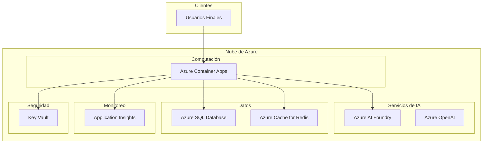

# Arquitectura de Despliegue

Este documento describe la arquitectura de despliegue en producción y la configuración de infraestructura.

## Descripción General del Despliegue



## Componentes de Infraestructura

### 1. Azure Container Apps

**Propósito**: Alojar todos los microservicios y frontend

**Configuración**:
- **Entorno**: Entorno único de Container Apps
- **Escalado**: Autoescalado basado en solicitudes HTTP y CPU
- **Ingress**: Interno para microservicios, externo para frontend

**Servicios Desplegados**:
1. Store Frontend (Ingress público)
2. Demo de Agente Único (Ingress interno)
3. Demo Multi-Agente (Ingress interno)
4. Servicio de Catálogo de Agentes (Ingress interno)
5. Servicio de Productos (Ingress interno)
6. 8 Microservicios (Ingress interno)

**Configuración de Escalado**:
```yaml
scale:
  minReplicas: 1
  maxReplicas: 10
  rules:
    - name: http-scaling
      http:
        metadata:
          concurrentRequests: 50
```

### 2. Azure AI Foundry

**Propósito**: Gestión y despliegue de agentes de IA

**Componentes**:
- **Proyecto**: Proyecto de IA central
- **Hub**: Hub de gestión de recursos
- **Agentes**: 8 agentes especializados
- **Despliegues**: Modelos GPT y de embeddings

### 3. Servicio Azure OpenAI

**Propósito**: Modelos LLM y de embeddings

**Despliegues**:

**GPT-4o-mini**:
- Modelo: gpt-4o-mini
- Versión: 2025-08-07
- Despliegue: gpt-5-mini
- SKU: GlobalStandard
- TPM: 150K tokens por minuto

**Text Embeddings**:
- Modelo: text-embedding-ada-002
- Versión: 2
- Dimensiones: 1536

### 4. Azure SQL Database

**Propósito**: Almacenamiento de datos persistente

**Configuración**:
- **Nivel**: Propósito General
- **Computación**: Sin servidor (pausa automática habilitada)
- **vCores**: 2-8 (autoescalado)
- **Almacenamiento**: 32 GB (máx 1 TB)

### 5. Azure Cache for Redis

**Propósito**: Caché distribuido

**Configuración**:
- **Nivel**: Estándar
- **Capacidad**: C1 (1 GB)
- **Persistencia**: AOF habilitada

### 6. Application Insights

**Propósito**: Monitoreo y diagnósticos

**Características Habilitadas**:
- Rastreo distribuido
- Métricas personalizadas
- Agregación de logs
- Transmisión de métricas en vivo

### 7. Azure Key Vault

**Propósito**: Gestión de secretos

**Secretos Almacenados**:
- Claves API de Azure OpenAI
- Cadenas de conexión SQL
- Cadenas de conexión Redis
- Claves de proyecto de AI Foundry
- IDs de agentes

### 8. Identidad Administrada

**Propósito**: Autenticación segura

**Servicios que Usan Identidad Administrada**:
- Container Apps → Key Vault
- Container Apps → Azure OpenAI
- Container Apps → SQL Database
- Container Apps → Redis

## Proceso de Despliegue

### Despliegue Automatizado con Azure Developer CLI

```bash
# Iniciar sesión en Azure
azd auth login

# Inicializar proyecto
azd init

# Aprovisionar infraestructura
azd provision

# Desplegar aplicación
azd deploy

# Despliegue completo
azd up
```

### Pasos de Despliegue Manual

#### 1. Creación de Grupo de Recursos
```bash
az group create \
  --name rg-aitour-brk445 \
  --location eastus
```

#### 2. Configuración de AI Foundry
```bash
# Crear hub de AI Foundry
az ml workspace create \
  --name aihub-brk445 \
  --resource-group rg-aitour-brk445
```

#### 3. Despliegue de Azure OpenAI
```bash
# Crear recurso OpenAI
az cognitiveservices account create \
  --name openai-brk445 \
  --resource-group rg-aitour-brk445 \
  --kind OpenAI \
  --sku S0
```

## Configuración de Entorno

### Desarrollo
```bash
export ASPNETCORE_ENVIRONMENT=Development
export ConnectionStrings__aifoundry="<cadena-de-conexión>"
```

### Producción
- Todos los secretos desde Key Vault
- Identidad Administrada para autenticación
- Aislamiento de red habilitado
- Autoescalado habilitado

## Alta Disponibilidad

### Redundancia de Servicios
- Múltiples réplicas por servicio
- Auto-sanación habilitada
- Verificaciones de salud configuradas
- Balanceo de carga

### Recuperación ante Desastres
- RTO: 1 hora
- RPO: 5 minutos
- Conmutación por error automatizada
- Simulacros regulares de DR

## Monitoreo y Alertas

### Verificaciones de Salud

```csharp
// Configuración de verificación de salud
builder.Services.AddHealthChecks()
    .AddSqlServer(connectionString)
    .AddRedis(redisConnection);

app.MapHealthChecks("/health");
```

### Alertas

**Alertas Críticas**:
- Servicio no disponible (más de 5 minutos)
- Alta tasa de errores (>5% de solicitudes)
- Fallos de conexión a base de datos

**Alertas de Advertencia**:
- Alto tiempo de respuesta (>5 segundos p95)
- Alto uso de CPU (>80%)
- Alto uso de memoria (>80%)

## Configuración de Seguridad

### Seguridad de Red
- Endpoints privados para todos los servicios de datos
- Integración de VNet para Container Apps
- Reglas NSG para control de tráfico

### Identidad y Acceso
- Identidad Administrada para autenticación de servicio
- Azure AD para autenticación de usuario
- RBAC para acceso a recursos

### Protección de Datos
- TLS 1.2+ en tránsito
- Cifrado en reposo (todos los datos)
- Rotación de claves (90 días)

## Optimización de Costos

### Costos de Recursos (Estimado Mensual)

| Recurso | Configuración | Costo Est. |
|----------|--------------|-----------|
| Container Apps | 10 servicios, autoescalado | $200 |
| Azure OpenAI | Nivel estándar, 1M tokens | $150 |
| AI Foundry | Proyecto + 8 agentes | $100 |
| SQL Database | Sin servidor, 2-8 vCores | $150 |
| Redis Cache | Estándar C1 | $75 |
| Application Insights | 10GB/mes | $25 |
| **Total** | | **~$700/mes** |

### Estrategias de Optimización de Costos

1. **Autoescalado**: Reducir escala durante horas fuera de servicio
2. **SQL Sin Servidor**: Pausa automática cuando está inactivo
3. **Capacidad Reservada**: Para OpenAI en producción
4. **Caché Eficiente**: Reducir llamadas a API de IA

## Objetivos de Rendimiento

| Métrica | Objetivo | Crítico |
|--------|--------|----------|
| Tiempo de Respuesta (p50) | <1s | <3s |
| Tiempo de Respuesta (p95) | <3s | <10s |
| Disponibilidad | >99.9% | >99% |
| Tasa de Error | <1% | <5% |

## Próximos Pasos

- [Guía de Inicio](07-getting-started.md) - Configuración de desarrollo
- [Guía del Desarrollador](08-developer-guide.md) - Prácticas de desarrollo
