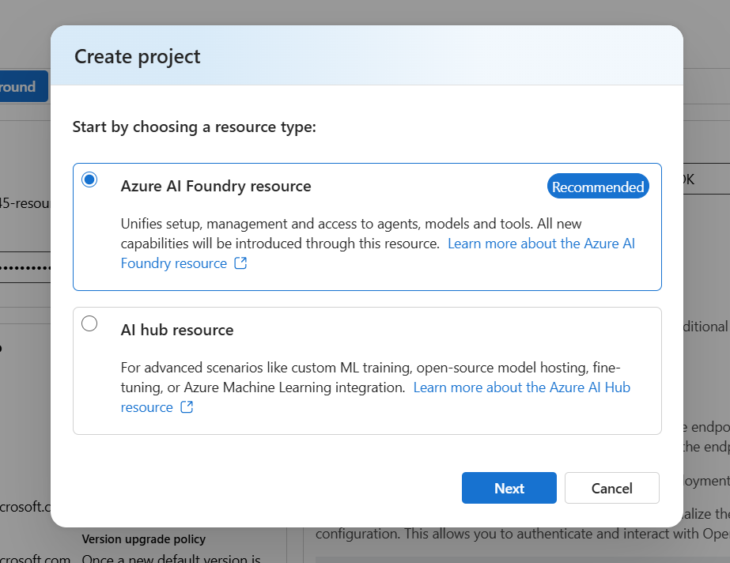
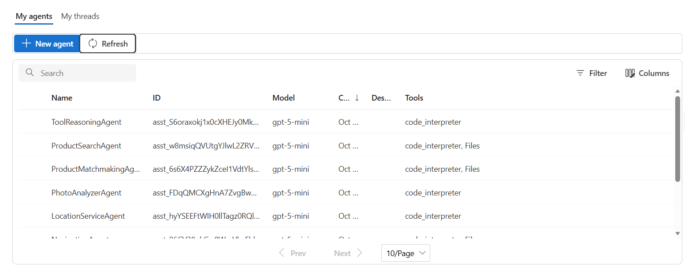
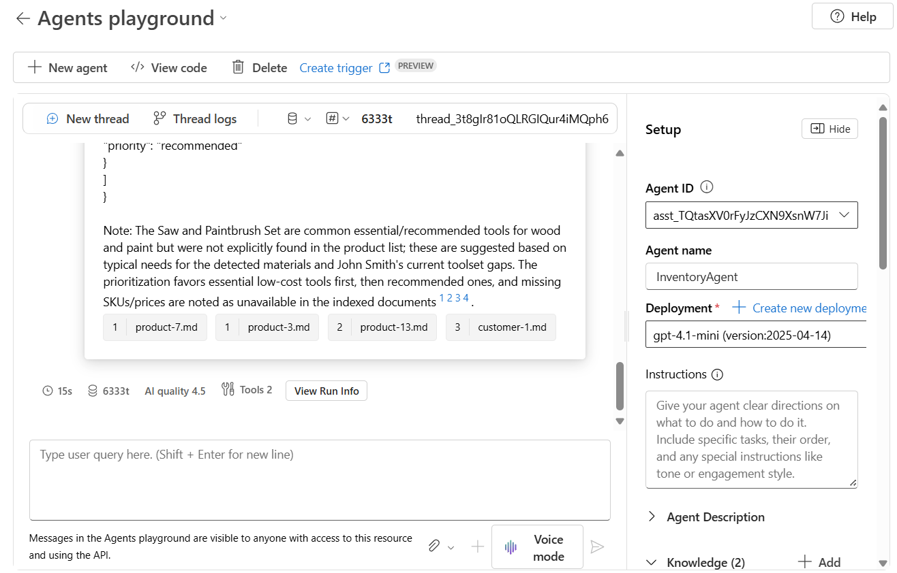

# Create Your Agents in Azure AI Foundry

This tutorial explains how to create and configure the azure resources and agents used by the aspiredemo (Zava‑Aspire) solution. It merges the original step notes with Azure AI Foundry guidance and adds practical tips for connecting agents to the demo solution.

Goals

- Create an AI Foundry project for the demo
- Create the agents required by the demo (Inventory, CustomerInformation, Navigation, LocationService, PhotoAnalyzer, ProductMatchmaking, ToolReasoning)
- Obtain agent IDs and wire them into the aspiredemo configuration

Reference: What is Azure AI Foundry — <https://learn.microsoft.com/azure/ai-foundry/what-is-azure-ai-foundry>

---

## 1) Prerequisites

- Azure subscription with permission to create resources
- Azure AI Foundry access: <https://ai.azure.com>
- Recommended region for this demo: East US 2 or Sweden Central (availability may vary by tenant)
- Recommended models: `gpt-5-mini` a

---

## 2) Create a Foundry Resource

1. Open <https://ai.azure.com> and sign in with your Azure account.
2. Create a new Project (for example, name it `ZavaDemo`) and choose the region (if available, select East US 2).
3. After the project is created, open it to access Models, Agents, and other resources.



TASK: Copy the project endpoint URL from the Project Settings page. You'll need these to connect the aspiredemo solution to your AI Foundry project.

---

## 3) Prepare model deployments

1. Inside your project, go to the Models area.
1. Create or select model deployments that the solution and agents will use.
1. For the demo we need 2 models
    1. A chat model: `gpt-5-mini`
    1. Optional. For the semantic search demo also need an embedding model: `text-embedding-ada-002`


TASK: for the semantic search demo, you need to get the Foundry COnnection string with this format: `Endpoint=https://<your-resource>.cognitiveservices.azure.com/;ApiKey=<your-api-key>`. You can find this in the Settings page of any of the deployed models.

---

## 4) Create agents using the console application

The project includes a console application that automates the creation of all required agents in your Azure AI Foundry project. This application reads agent definitions from a JSON configuration file and deploys them with their associated knowledge files.

### Authenticate with Azure CLI

Before running the console application, you need to authenticate with Azure using the Azure CLI:

1. **Login to Azure with your tenant**:

   ```bash
   az login --tenant <your-tenant-url> --use-device-code
   ```

   Replace `<your-tenant-url>` with your Azure tenant domain (e.g., `yourcompany.onmicrosoft.com`)

2. **Follow the device code authentication flow**:
   - The command will display a device code and a URL
   - Open the URL in a web browser
   - Enter the device code when prompted
   - Sign in with your Azure credentials
   - Confirm the authentication in the browser

3. **Verify your login**:

   ```bash
   az account show
   ```

   This should display information about your current Azure subscription and tenant.

**Important**: This authentication step is required because the console application uses `DefaultAzureCredential`, which relies on your Azure CLI authentication to access your AI Foundry project.

### Navigate to the console application

1. Open a terminal and navigate to the console application directory:

   ```bash
   cd /workspaces/aitour26-BRK445-building-enterprise-ready-ai-agents-with-azure-ai-foundry/infra
   ```

2. The console application is a .NET project with the following key files:
   - `Program.cs` - Main entry point for the deployment application
   - `agents.json` - Configuration file containing all agent definitions
   - `Brk445-Console-DeployAgents.csproj` - Project file with dependencies

### Set user secrets for the console application

The console application requires three configuration values that should be stored as user secrets for security:

1. **ProjectEndpoint**: Your Azure AI Foundry project endpoint URL (from step 2)
2. **ModelDeploymentName**: The name of your chat model deployment (e.g., `gpt-5-mini`)
3. **TenantId**: Your Azure tenant ID

Run the following commands to set the user secrets:

```bash
dotnet user-secrets init
dotnet user-secrets set "ProjectEndpoint" "https://your-project-endpoint-url"
dotnet user-secrets set "ModelDeploymentName" "gpt-5-mini"
dotnet user-secrets set "TenantId" "your-azure-tenant-id"
```

**Note**: Replace the placeholder values with your actual:

- Project endpoint URL from your AI Foundry project settings
- Model deployment name from your model deployments
- Azure tenant ID (you can find this in the Azure portal under Azure Active Directory)

### Compile and run the console application

1. **Restore dependencies and build the project**:

   ```bash
   dotnet restore
   dotnet build
   ```

2. **Run the application to deploy agents**:

   ```bash
   dotnet run
   ```

3. **Optional command line flags**:
   - `--delete`: Automatically delete existing agents without prompting
   - `--no-delete`: Skip deletion and only create new agents

   ```bash
   dotnet run -- --delete
   ```

4. **Expected output**: The application will:
   - Connect to your Azure AI Foundry project using your credentials
   - Read agent definitions from `agents.json`
   - Create or update each agent with their instructions and knowledge files
   - Display agent IDs for each created agent

**Important**: Make sure you're signed in to Azure CLI (`az login`) or have appropriate Azure credentials configured, as the application uses DefaultAzureCredential for authentication.

This is a sample of the generated agents in your AI Foundry Resource:


> TASK: Copy the agent IDs displayed in the console output. You'll need these IDs to configure the main Aspire demo application.

> NOTE: Once the console application run is finished, the app will show the generated files with the information that you need.

```bash
--- Starting creation of agent: ToolReasoningAgent
 Instructions length: 685 chars
 Files referenced: 0
 Creating agent with CodeInterpreter tool only...
 [SUCCESS] Agent created: ToolReasoningAgent => asst_S6oraxokj1x0cXHEJy0MkKxt

Plain text log written to: /workspaces/aitour26-BRK445-building-enterprise-ready-ai-agents-with-azure-ai-foundry/infra/bin/Debug/net9.0/CreatedAgents.txt
JSON connection string map written to: /workspaces/aitour26-BRK445-building-enterprise-ready-ai-agents-with-azure-ai-foundry/infra/bin/Debug/net9.0/CreatedAgents.json
```

Copy or open these files as a fast way to get the Ids of each created agent.

---

## 5) (Optional) Add Knowledge to an Agent

The creation of agents already added files, so the agents have some knowledge. The following steps are optionals if you want to expand the Agent's Knowledge to use other sources.

A agent retrieves documents from a knowledge store (e.g., Files or Azure AI Search) and generates answers based on retrieved content.

1. Select the InventoryAgent you created.

1. In the agent configuration, select `Add` in the `Knowledge` section.

1. Upload the documents from the `session-delivery-resources/infra/docs` folder.

1. If you also have an Azure AI Search index with Zava information, you can connect the index to the agent.


1. Test the agent with a sample prompt, from the [prompts\Inventory Agent Sample Prompts.txt]  to ensure it retrieves and uses the knowledge correctly.

1. The results should include references to the knowledge source.



---

## 6) Create an Application Insights resource in Azure

1. In the Azure portal, create a new Application Insights resource in the same region as your Foundry project.

TASK: Copy the Connection String from the Application Insights resource overview page.


